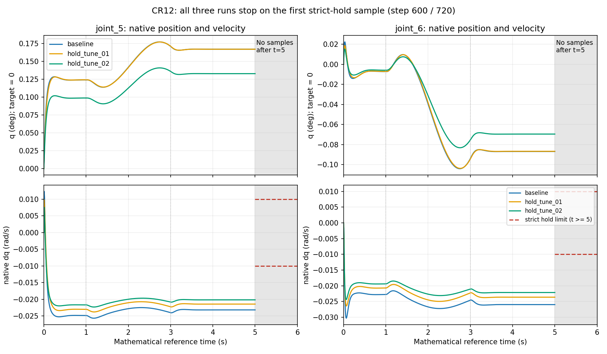

# CR12 保持行为诊断、局部 PD 调试与原条件复测报告

执行日期：2026-09-29，Asia/Shanghai（UTC+08:00）。**本轮诊断和授权内调试已完成；三次完整运动与保持验收均 FAIL；基本驱动阶段未关闭，等待 GPT/用户审阅。**

本文 `T/` 为 `source/isaaclab_tasks/isaaclab_tasks/direct/scan_mobile_manipulator/`，`E/` 为 `logs/scan_assignment/20260929_cr12_hold_diagnosis/`。工作目录始终为 `E:\Project\IsaacLab_HARL`，HEAD `24ecbad7dd1bdcd006399b64bfb757a86b71aeec`。本轮使用新授权，不更改上一轮失败或已耗尽预算的历史记录。

## 1. 执行摘要

用户已接受[上一轮报告](CR12_DERIVED_ASSET_AND_JOINT_DRIVE_IMPLEMENTATION_REPORT.md)中的 v1 派生资产及 URDF/USD/PhysX 分层参数检查成果，同时保留完整保持 FAIL。本轮没有重新生成资产或调查 Windows 兼容性，实际完成：定向源码审查 → 诊断记录修正 → 原 PD 基线 → 两组有依据的局部 PD 候选 → 原条件复测。

| 本轮 profile | t=5 时轴5 / 轴6绝对速度，rad/s | 受控完成量 | 末秒已观测 / 应有样本 | 验收 |
|---|---:|---|---:|---|
| baseline | 0.023184916 / 0.025973620 | 600 / 720；5.000000260770321 s | 1 / 121 | **FAIL** |
| hold_tune_01 | 0.021448467 / 0.023611216 | 600 / 720；5.000000260770321 s | 1 / 121 | **FAIL** |
| hold_tune_02 | 0.020183425 / 0.022130456 | 600 / 720；5.000000260770321 s | 1 / 121 | **FAIL** |

三个进程均在数学参考 **t=5 秒的第600步**立即停止。末秒逐样本速度上限仍为 **0.01 rad/s**，不是 RMS/平均值判据。候选1较基线降低当时轴5/6速度约 **7.49% / 9.10%**；最终候选约 **12.95% / 14.80%**，仍为门限约 **2.02 / 2.21 倍**。没有任何6秒终点或 t>5 数据，没有通过版本可推荐为默认。

主要发现是：**保持段位置变化已衰减到极小，原生 dq 却持续非零；下发目标恒定。** 不把它归因为欠阻尼、持续振荡、物理饱和、显卡问题或数值噪声。当前证据不足以确定这一状态特征的根因；有限调参改善了读回数值，但未满足原标准。

预算实际使用 **A=3/3，B=0/2，总 App=3/5**；三次全为进入受控运动的A类。未用B类额度不产生额外控制试验权限。第三次后停止全部 runtime。三次目标 Python/Conda 均自然 exit 0，但内部 FAIL、外层监督命令 exit 1；未因正常退出改写验收结论。

## 2. 定向源码检查与实施变更

### 2.1 未发现保持失败对应的明确控制错误

审计起点的 driver、数学模块、机器人配置和测试与上一轮保留的 `attempt_03/implementation.patch` 对应。仅沿当前执行链核查：

| 环节 | 当前源码与证据 | 结论 |
|---|---|---|
| 轨迹与数学时间 | `scripts/environments/_cr12_asset_math.py:152–170` 的 `trajectory/step_reference_times`；driver `check_joint_sample:41`、`_run_drive:514` | t_after 同时用于提交目标和步后比较；0–1、1–3、3–6秒定义保持，无错开一拍的已知错误 |
| 名称映射 | 数学模块 `name_indices:127`、driver `_read_physics:223` | 按名称映射，拒绝缺失/重复/额外名称；本轮实际索引恰为0…5，不以此替代映射 |
| setter → 实际下发 | `source/isaaclab/isaaclab/assets/articulation/articulation.py:882,906,1432,194–200` | setter复制到命令缓存；ImplicitActuator原样返回位置/速度目标，随后调用PhysX setter；没有发现额外目标覆盖 |
| 状态刷新 | 同文件 `update:202`；`articulation_data.py:update:78、joint_pos:529、joint_vel:538、joint_acc:547` | step后推进数据时间戳并读取后端；未发现把上一物理步缓存作为本步状态的明确错误 |
| 惯量语义 | `_cr12_asset_math.py:135` 的 `checked_physx_body_inertia` | 保留上一轮修正：关于COM、以link/object轴表达；只做逆主轴交叉检查，没有再次正向旋转 |
| 初始化与步进 | driver `_run_drive:514` | 一次sim.reset、一次初始化joint-state写入；受控循环单次step(render=False)，每两步单独render并检查计数；无额外settle、teleport、积分器或重力补偿 |

本轮追加的实际下发核对来自 `_capture_submitted_targets:479`：在 `write_data_to_sim()` 后复制 `_joint_pos_target_sim/_joint_vel_target_sim`，逐值比对传入setter的float32数组和公开命令缓存，并确认前馈effort目标为零。这些正是本地 `Articulation.write_data_to_sim` 传给PhysX的数组，**不是另算理想轨迹冒充已下发命令**。三次各完成600次核对；3–5秒六轴位置/速度目标均恒定（q2为float32的5°，其余q为0，全部dq_target为0）。

### 2.2 本轮局部变更与影响

| 文件 | 符号/位置 | 实际改变 |
|---|---|---|
| `scripts/environments/run_cr12_joint_drive.py` | `_parse_args:131`、`_capture_submitted_targets:479`、`_sync_diagnostics:498`、`_run_drive:514` | 增加显式profile/trace、实际命令快照、失败前记录、覆盖窗口和严格完成条件；最终PhysX K/D对照预先选择的profile |
| 同上 | `Recorder.fail:96/secondary:112`、`main:737` | 原异常优先保留，记录/关闭异常另列；记录失败不阻止尝试关闭；失败不能因exit0改回通过 |
| `scripts/environments/_cr12_hold_diagnostics.py`（新增） | `validate_pd_profile:79`、`JointTrace:135`、`append:180/summary:295` | 纯CPU诊断及明确profile；一次CSV，独立数值副本、空窗口null、失败粘性、完整窗口检查 |
| `source/isaaclab_assets/isaaclab_assets/robots/rokea_cr12.py` | `make_cr12_cfg:33` | 增加显式stiffness/damping关键字；不改变baseline常量、默认配置、质量/限制或资产 |
| `source/isaaclab_tasks/test/test_cr12_asset_math.py` | `HoldDiagnosticsTests:256` | 失败样本、窗口、别名、非有限、I/O、CLI和候选范围的针对性CPU测试 |
| `E/repro/supervise_cr12_hold.py`（新增） | `classify_attempt/entry_completion/check_previous_attempts` | 复用原Job监督方法，适配新A/B预算、profile/trace及成功事实；不修改旧监督脚本 |

**未修复任何已证实的控制下发错误。** 基线前的控制参数、轨迹、物理设置、初始化路径和判据未改变；记录顺序改为步后刷新q/dq后先快照，再执行接触 → joint → geometry → frame判据。非有限状态一经观察即停止进一步监测API；这是故障处理边界，不是正常路径的新控制算法。接触摘要也先保留有效超限观测再抛出，阈值不变。

CSV最多为基线1行加720受控行，列明确s/rad/rad/s、数学参考时间、实际时间、真正下发目标、实际q/dq及检查状态。结果的 `drive_summary.baseline_target_source/controlled_target_source` 分别说明：基线目标来自初始化setter缓存，受控目标来自实际write_data_to_sim后的下发缓存；CSV保存这些对应数值，没有另设target_source列。CSV的 `reference_source=mathematical_reference` 指误差比较使用原数学参考，不是下发目标的来源标签。基线行不计入控制窗口；初始化验证由原参数/初态检查及physics_ready事实承载。

每个样本复制成不可变数值，不持有可被后续改写的tensor/数组引用；在阶段边界、失败和关闭前flush。写入上一行失败时也保留当前已取得样本到内存摘要。JSON只存紧凑结果，不复制完整CSV。数学误差仍对原float64参考计算，未改成float32命令误差；使用q差分/RMS/平均值只作诊断。

各窗口有sample_count、起止step/实际/相对/参考时间和complete；接触、joint、geometry、frame、clock分别记录检查覆盖。末秒定义为 **step600…720，含两端，共121样本**，没有移到601步。没有样本的极值是null；已取得但失败的600步计入真实极值。完整覆盖不等于通过，成功还要求所有检查、无失败、足额计数及正常退出。

## 3. 三组明确的运行期 PD

K单位Nm/rad，D单位Nm·s/rad；下表每格为K / D。所有轴velocity_limit_sim保持0.2rad/s，effort上限保持原值，force position drive + ImplicitActuator不变。

| 轴 | baseline K / D | hold_tune_01 K / D | hold_tune_02 K / D | effort_limit_sim，Nm |
|---|---:|---:|---:|---:|
| joint_1 | 200 / 20 | 200 / 20 | 200 / 20 | 20 |
| joint_2 | 4000 / 550 | 4000 / 550 | 4000 / 550 | 60 |
| joint_3 | 2000 / 166 | 2000 / 166 | 2000 / 166 | 30 |
| joint_4 | 200 / 12 | 200 / 12 | 200 / 12 | 10 |
| joint_5 | 1000 / 37 | 1000 / 44.03609933679412 | 1250 / 49.23385579050253 | 10 |
| joint_6 | 150 / 7 | 150 / 8.48098097910849 | 187.5 / 9.482024992584654 | 5 |

原J估算依次为 `(0.405887645,18.794490640,3.448809055,0.158322694,0.336662855,0.083248887) kg·m²`；只用于本次调试范围，不代表多轴系统已临界阻尼。候选验证始终相对原baseline：K∈[0.8,1.25]K_baseline，改动轴D∈[0.8,1.2]×2√(KJ)。采用公式全精度值，未把44.036…舍入到越界的44.04。

- **候选1依据**：基线目标恒定，位置趋稳，原生速度持续偏置；没有持续换号或饱和证据。仅提高轴5/6的D到当前K下的允许上界，测试速度反馈权重对读回的影响。预期可能降低残余dq，也可能影响位置偏置/耦合轴，不保证改善。
- **候选2依据**：候选1速度有所下降但仍超限，因此仅把轴5/6的K提高到原值1.25倍，D取新K下的允许上界，作最后一次更大增益尺度试验。D较候选1再增约11.8%。**同时改变K和D，结果不能单独归因于其中一个。** 没有把其他四轴一起缩放，也没有扩大上限或改控制算法。

每次App前选择完整六轴profile，再传入配置；最终PhysX参数与该预先选择比较，不从观测值生成期望：

| profile | 实际PhysX K5 / K6 | 实际PhysX D5 / D6 | 结果 |
|---|---:|---:|---|
| baseline | 1000 / 150 | 37 / 7 | 全六轴原容差通过 |
| hold_tune_01 | 1000 / 150 | 44.03609848022461 / 8.48098087310791 | 全六轴原容差通过 |
| hold_tune_02 | 1250 / 187.5 | 49.233856201171875 / 9.482025146484375 | 全六轴原容差通过 |

质量、COM、惯量、limits、effort、velocity、friction=0、armature=0、唯一固定根及监测前置检查均保持原期望并通过。USD中的原驱动属性没有改写；候选PD仅在运行期覆盖，默认仍为baseline。两个候选保留名称和失败事实供复核，**没有任何候选被静默提升为默认或通过配置**。

## 4. 实际场景、命令和进程

本轮唯一资产：
`T/assets/rokeaCR12/derived/fixed_lift0_v1/usd/cr12_fixed_lift0.usd` 及原引用层。没有生成器/转换App、v2模型或资产写入。固定底盘、升降q0=0、7体6轴、原纯frame和初始化root anchor校准保持；运行期不移动root/anchor。

三次统一：GUI、实际D3D12、cuda:0；dt=1/120s、render_interval=2、重力(0,0,-9.81)、GPU pipeline/GPU dynamics=true、TGS、position/velocity iterations=8/2。地面/灯光/单CR12，无构件或扫描相机；contact_offset=0.002m/rest_offset=0。原0–1秒保持、1–3秒joint_2五次轨迹至5°、3–6秒保持不变，位置和解析速度目标同时下发。没有延长settle或让失败后继续到6秒。

解释器实际为 `C:\isaacenvs\isaac45_harl\python.exe`，UTF8=1；experience为 `E:\Project\IsaacLab_HARL\apps\isaaclab.python.kit`。参数解析 → 已接受Windows helper → 已有pre-App CUDA准备 → AppLauncher → 配置/Articulation顺序不变。省略kit_args，缺省D3D12由三次各自Kit日志确认，未运行旧viewer.main。子进程只在继承环境副本中明确GUI/camera/livestream/XR开关，无持久设置更改。

### 4.1 实际外层监督命令

工作目录均为 `E:\Project\IsaacLab_HARL`；按顺序执行，前一次全部所属进程退出后才启动下一次。以下是已经执行的命令，不是授权继续重跑：

```powershell
& 'D:\miniconda3\Scripts\conda.exe' run --no-capture-output -p 'C:\isaacenvs\isaac45_harl' python -u logs/scan_assignment/20260929_cr12_hold_diagnosis/repro/supervise_cr12_hold.py --attempt-dir logs/scan_assignment/20260929_cr12_hold_diagnosis/attempt_01 --usd-path source/isaaclab_tasks/isaaclab_tasks/direct/scan_mobile_manipulator/assets/rokeaCR12/derived/fixed_lift0_v1/usd/cr12_fixed_lift0.usd --pd-profile baseline --record-joint-trace

& 'D:\miniconda3\Scripts\conda.exe' run --no-capture-output -p 'C:\isaacenvs\isaac45_harl' python -u logs/scan_assignment/20260929_cr12_hold_diagnosis/repro/supervise_cr12_hold.py --attempt-dir logs/scan_assignment/20260929_cr12_hold_diagnosis/attempt_02 --usd-path source/isaaclab_tasks/isaaclab_tasks/direct/scan_mobile_manipulator/assets/rokeaCR12/derived/fixed_lift0_v1/usd/cr12_fixed_lift0.usd --pd-profile hold_tune_01 --record-joint-trace --decision-note 'Baseline raw dq5/6 stays negative while position stabilizes; change only D5/6 to the approved upper bound to test velocity feedback sensitivity, not an assumed underdamping cure.'

& 'D:\miniconda3\Scripts\conda.exe' run --no-capture-output -p 'C:\isaacenvs\isaac45_harl' python -u logs/scan_assignment/20260929_cr12_hold_diagnosis/repro/supervise_cr12_hold.py --attempt-dir logs/scan_assignment/20260929_cr12_hold_diagnosis/attempt_03 --usd-path source/isaaclab_tasks/isaaclab_tasks/direct/scan_mobile_manipulator/assets/rokeaCR12/derived/fixed_lift0_v1/usd/cr12_fixed_lift0.usd --pd-profile hold_tune_02 --record-joint-trace --decision-note 'Candidate 01 reduced raw dq5/6 by 7.49 and 9.10 percent but failed; test only joint5/6 K at 1.25 baseline with D at 1.2 critical-scale bound, preserving all other conditions.'
```

监督器实际创建的目标命令（由当次argv记录整理，包含完整参数）：

```powershell
& D:\miniconda3\Scripts\conda.exe run --no-capture-output -p C:\isaacenvs\isaac45_harl python -u scripts/environments/run_cr12_joint_drive.py --usd-path E:\Project\IsaacLab_HARL\source\isaaclab_tasks\isaaclab_tasks\direct\scan_mobile_manipulator\assets\rokeaCR12\derived\fixed_lift0_v1\usd\cr12_fixed_lift0.usd --physics_steps 720 --output-dir E:\Project\IsaacLab_HARL\logs\scan_assignment\20260929_cr12_hold_diagnosis\attempt_01 --device cuda:0 --pd-profile baseline --record-joint-trace --info

& D:\miniconda3\Scripts\conda.exe run --no-capture-output -p C:\isaacenvs\isaac45_harl python -u scripts/environments/run_cr12_joint_drive.py --usd-path E:\Project\IsaacLab_HARL\source\isaaclab_tasks\isaaclab_tasks\direct\scan_mobile_manipulator\assets\rokeaCR12\derived\fixed_lift0_v1\usd\cr12_fixed_lift0.usd --physics_steps 720 --output-dir E:\Project\IsaacLab_HARL\logs\scan_assignment\20260929_cr12_hold_diagnosis\attempt_02 --device cuda:0 --pd-profile hold_tune_01 --record-joint-trace --info

& D:\miniconda3\Scripts\conda.exe run --no-capture-output -p C:\isaacenvs\isaac45_harl python -u scripts/environments/run_cr12_joint_drive.py --usd-path E:\Project\IsaacLab_HARL\source\isaaclab_tasks\isaaclab_tasks\direct\scan_mobile_manipulator\assets\rokeaCR12\derived\fixed_lift0_v1\usd\cr12_fixed_lift0.usd --physics_steps 720 --output-dir E:\Project\IsaacLab_HARL\logs\scan_assignment\20260929_cr12_hold_diagnosis\attempt_03 --device cuda:0 --pd-profile hold_tune_02 --record-joint-trace --info
```

### 4.2 运行时间、退出和预算

时间均为2026-09-29、UTC+08:00。App/全树耗时来自独立monotonic计时，非四舍五入墙钟相减。

| attempt / profile | 起止本地时间 | Python / Conda PID | App构造 / 全树秒 | 目标 / Conda / 外层退出码 | 类别 |
|---|---|---|---:|---|---|
| 01 baseline | 15:08:30.300 → 15:09:04.052 | 6104 / 3684 | 13.766 / 33.765 | 0 / 0 / 1 | A |
| 02 hold_tune_01 | 15:13:40.125 → 15:14:13.747 | 29808 / 21264 | 13.625 / 33.625 | 0 / 0 / 1 | A |
| 03 hold_tune_02 | 15:17:01.771 → 15:17:35.544 | 12244 / 24468 | 13.625 / 33.782 | 0 / 0 / 1 | A |

三次均：桌面可用；独占Windows Job在恢复子进程前建立；输出实时排空；180秒App/360秒全树限制未触发；无强制终止、无遗留所属进程。sim.stop返回、trace关闭、app.close请求前失败事实已保存，原生close没有返回Python而目标自然退出。两层子进程exit0不能覆盖内部失败，外层返回1，Conda随后显示的失败摘要是监督命令非零退出，不能误称启动参数解析或GPU故障。

对应Kit日志为 `kit_20260929_150833.log`、`kit_20260929_151343.log`、`kit_20260929_151705.log`，实际D3D12位置分别3438、3470、3531行。没有发现新的原生GPU/CUDA/device-lost故障；已有扩展/启动类警告不作为保持失败根因，也未为清除警告改动环境。

累计 **A3/B0/App3**。监督器单次分类的 `EVIDENCE_BASED_PD_REVIEW` 表示失败类型，**不覆盖累计A3禁续条件**。本轮剩余B类名额及总App差额不能用于第四次运动。

## 5. 真实结果与检查覆盖

三次六轴起点q/dq均为零。初始化reset单列为2步/0.01666666753590107秒，随后一次初态joint-state写入，无root-state写入或额外settle。受控基线从该时刻建立。每次实际受控600步/5.000000260770321秒、299次render、600次实际target核对；没有用循环次数或渲染帧冒充物理计数。

### 5.1 每轴原始状态判据

下表极值包括已观测的失败步600；“末次”仅为t=5停止样本，**不是6秒终点**。最大误差对原数学参考计算，速度为原生未滤波dq。

| profile | 轴 | 600样本最大位置误差° | 600样本最大绝对速度rad/s | t=5实际位置° | t=5原生dq rad/s |
|---|---|---:|---:|---:|---:|
| baseline | joint_1 | 0.030597893 | 0.007379265 | 0.006714367 | 0.005991803 |
| baseline | joint_2 | 0.329173151 | 0.087915927 | 5.297537409 | -0.001313208 |
| baseline | joint_3 | 0.338239025 | 0.010190326 | 0.303719596 | -0.002486784 |
| baseline | joint_4 | 0.156460517 | 0.010972766 | 0.130164956 | 0.006123691 |
| baseline | joint_5 | 0.177328880 | 0.025670422 | 0.167138491 | -0.023184916 |
| baseline | joint_6 | 0.104028130 | 0.030289942 | -0.086883168 | -0.025973620 |
| hold_tune_01 | joint_1 | 0.030605417 | 0.007548879 | 0.006714442 | 0.005964133 |
| hold_tune_01 | joint_2 | 0.329181262 | 0.088039912 | 5.297548081 | -0.001201523 |
| hold_tune_01 | joint_3 | 0.338198071 | 0.009489315 | 0.303680536 | -0.002871993 |
| hold_tune_01 | joint_4 | 0.156370578 | 0.010018108 | 0.130073776 | 0.005209551 |
| hold_tune_01 | joint_5 | 0.177200894 | 0.023797594 | 0.167097390 | -0.021448467 |
| hold_tune_01 | joint_6 | 0.103697466 | 0.026423363 | -0.086712140 | -0.023611216 |
| hold_tune_02 | joint_1 | 0.030631537 | 0.007636688 | 0.006727814 | 0.005947420 |
| hold_tune_02 | joint_2 | 0.329061307 | 0.088121422 | 5.297455874 | -0.001128102 |
| hold_tune_02 | joint_3 | 0.337812699 | 0.009156978 | 0.303345323 | -0.003156564 |
| hold_tune_02 | joint_4 | 0.156458636 | 0.009494987 | 0.130144025 | 0.004672176 |
| hold_tune_02 | joint_5 | 0.140980040 | 0.022322772 | 0.132917589 | -0.020183425 |
| hold_tune_02 | joint_6 | 0.083124456 | 0.024369709 | -0.069513250 | -0.022130456 |

三次已观测段位置误差均≤0.5°、速度绝对值均≤0.25rad/s，未触发硬限位/NaN/Inf；t=2的至少1°进展检查通过。joint_2在停止时均超过4.5°，但**未取得6秒最终状态，不把提前达到位置替代完整保持成功**。

t=5首次启用末秒速度≤0.01rad/s时，三次均轴5/6超限，立即结束。末秒窗口实际1/121，complete=false，极值为该失败样本实际值；5–6秒后续120样本未取得，没有延长运行或补造数据。

| 检查 | 三次实际覆盖 | 未完成/限制 |
|---|---|---|
| 实际clock | 600/600已观测步通过 | 601–720未执行 |
| 接触有效性与禁止接触 | 七传感器各600次强制刷新；600步通过，禁止pair最大0N | 非空路径/过滤矩阵核验通过；不据此认证未执行区间 |
| joint判据 | 599通过＋第600步FAIL | 第600步已纳入位置/速度窗口，末秒不再显示默认零 |
| geometry与frame | 前599受控步通过 | 第600步明确NOT_CHECKED，后续120步未观测 |
| root/固定frame | 已检查部分root最大漂移0m/0rad，四frame相对误差均0 | 属于固定结构；不是升降主动控制 |
| 保守几何守卫 | 已检查部分未触发；活动臂AABB最低z约1.239998764m | 使用实际link位姿与既有凸包输入AABB，不是新规划器或全轨迹安全证明 |
| 全实验 | 三次work_completed=false、diagnostics_complete=false | 无720步/6秒完整运行，无完整121样本保持窗口 |

CSV均601行数据：baseline1行＋600受控行。第600行的clock/contact=PASS，joint=FAIL，geometry/frame=NOT_CHECKED。摘要的未检查数包含未执行后续步，不能误解为已经取得那些样本。各窗口端点可以重叠，例如t=5同时用于[4,5]区间分析与严格保持；不可把窗口样本数相加当成唯一总样本数。

## 6. 保持行为分析：观察到什么、不能下什么结论



曲线直接来自三份CSV，未滤波；5秒后不延长线条。红线只表示从t=5开始的严格保持门限。基线末态与上一轮已保存的六轴末态逐值一致，补日志没有被宣称为动力学修复。

### 6.1 分段趋势

下表只列轴5/6；RMS和峰峰值用于诊断，验收仍检查每一原生dq样本。

| profile | 参考区间 | 样本数 | q峰峰值，轴5 / 轴6，° | dq RMS，轴5 / 轴6，rad/s | dq符号变化，轴5 / 轴6 |
|---|---|---:|---:|---:|---:|
| baseline | (0,1]，初始保持 | 120 | 0.112416309 / 0.036423506 | 0.023740570 / 0.023165264 | 1 / 0 |
| baseline | (1,3]，运动 | 240 | 0.063384396 / 0.113736967 | 0.023648755 / 0.025248122 | 0 / 0 |
| baseline | [3,4]，后续保持 | 121 | 0.005376680 / 0.008970927 | 0.023256592 / 0.025847397 | 0 / 0 |
| baseline | [4,5]，后续保持 | 121 | 0.000008511 / 0.000009785 | 0.023184776 / 0.025973772 | 0 / 0 |
| hold_tune_01 | (0,1]，初始保持 | 120 | 0.113907120 / 0.032098428 | 0.021815733 / 0.021035001 | 1 / 0 |
| hold_tune_01 | (1,3]，运动 | 240 | 0.063022903 / 0.113335303 | 0.021857890 / 0.023037737 | 0 / 0 |
| hold_tune_01 | [3,4]，后续保持 | 121 | 0.005572180 / 0.009416323 | 0.021525018 / 0.023474798 | 0 / 0 |
| hold_tune_01 | [4,5]，后续保持 | 121 | 0.000008591 / 0.000009058 | 0.021448361 / 0.023611358 | 0 / 0 |
| hold_tune_02 | (0,1]，初始保持 | 120 | 0.088937289 / 0.025987617 | 0.020692254 / 0.019667159 | 1 / 0 |
| hold_tune_02 | (1,3]，运动 | 240 | 0.050231532 / 0.090690281 | 0.020643382 / 0.021476469 | 0 / 0 |
| hold_tune_02 | [3,4]，后续保持 | 121 | 0.004291226 / 0.007208818 | 0.020241141 / 0.022026791 | 0 / 0 |
| hold_tune_02 | [4,5]，后续保持 | 121 | 0.000006056 / 0.000006623 | 0.020183327 / 0.022130565 | 0 / 0 |

初始保持段就存在较大的原生dq，并非t=5才开始出现问题；t=5只是更严格的门限开始生效。运动结束后的q变化在3–4秒衰减，4–5秒基本趋稳；三组该段dq均不换号，速度偏置没有继续衰减至零。因此不把它描述成保持段的持续周期振荡，也不把RMS下降等同逐样本通过。t>5无数据，不分析不存在的5–6秒衰减。

### 6.2 位置变化与原生速度的持续差异

使用[4,5]闭区间121样本，将原生dq作梯形积分，仅作一致性诊断：

| profile | q端差，轴5 / 轴6，rad | 原生dq积分，轴5 / 轴6，rad | 原生dq标准差，轴5 / 轴6，rad/s |
|---|---:|---:|---:|
| baseline | 0.000000130618 / -0.000000152271 | -0.023184778 / -0.025973771 | 0.000000274476 / 0.000000308753 |
| hold_tune_01 | 0.000000130851 / -0.000000139698 | -0.021448362 / -0.023611359 | 0.000000276754 / 0.000000306682 |
| hold_tune_02 | 0.000000093598 / -0.000000104192 | -0.020183329 / -0.022130565 | 0.000000196729 / 0.000000203674 |

位置端差约1e-7rad，而dq积分约2e-2rad，不能仅用浮点舍入或“瞬时速度不同于区间平均速度”解释完。本地安装API `C:/isaacenvs/isaac45_harl/Lib/site-packages/isaacsim/extsPhysics/omni.physics.tensors/omni/physics/tensors/impl/api.py:get_dof_positions:1379、get_dof_velocities:1408` 调用后端并说明关节位置/速度单位，但没有提供足以确定这一持续差异根因的原生求解实现证据。

当前没有做“同一时刻先复制缓存、再单独原生getter、再用刚体角速度交叉核对”的额外运行，故不能排他判定缓存/读回阶段或求解器位置修正语义，更不能宣称真实速度为零。原生dq依然是用户指定验收信号；没有用位置差分、平均、过滤或最后一个合格样本替换它。

### 6.3 力矩只是同刻PD估算

本地 `source/isaaclab/isaaclab/actuators/actuator_pd.py:115–140` 的ImplicitActuator计算PD估算并限幅，仍原样返回位置/速度目标；`articulation.py:1463–1464` 的computed/applied缓存产生于步前write_data_to_sim，robot.update后不会重算。因此本轮未把这些缓存与步后状态拼成“实测力矩”。

离线只用同一CSV行的真实目标和步后q/dq计算
`tau_pd_est_post = K*(q_target-q) + D*(dq_target-dq)`。
这是诊断估算，不是隐式求解器实际力矩的精确重建；**原生实测驱动力矩未取得**，未新增力传感器。

| profile | 已观测600步最大绝对PD估算，轴5 / 轴6，Nm | 占固定effort上限%，轴5 / 轴6 |
|---|---:|---:|
| baseline | 2.2401356 / 0.4542822 | 22.401 / 9.086 |
| hold_tune_01 | 2.1521475 / 0.4721637 | 21.521 / 9.443 |
| hold_tune_02 | 2.0854278 / 0.4820029 | 20.854 / 9.640 |

估算没有接近轴5/6的10/5Nm上限，但这既不是已证实物理饱和，也不能证明求解器从未触及任何内部约束。没有以饱和推断为理由提高effort上限。

## 7. 已执行的CPU检查、证据限制与文件保护

在创建本轮第一个App前核对解释器及UTF8、语法和针对性纯CPU测试。基线诊断版本10/10（root确认0.129秒），候选1后11/11（0.137秒），最终候选2后12/12（0.134秒），均exit0。测试包含首个末秒样本失败、无观测null、未执行检查、独立副本、1/2/3/5/6秒边界、非有限值、记录失败/正常关闭不产生成功、真实CLI纯解析、完整720合成数据经过实际成功条件，以及候选原baseline界限和越界拒绝。合成720测试仅验证CPU记录逻辑，**不是720步仿真通过**。

主要实际检查命令（测试仅选择本轮类，不运行旧资产fixture套件/Windows/Phase B）：

```powershell
& 'D:\miniconda3\Scripts\conda.exe' run -p 'C:\isaacenvs\isaac45_harl' python -c "import sys; print(sys.executable); print(sys.flags.utf8_mode)"
& 'D:\miniconda3\Scripts\conda.exe' run -p 'C:\isaacenvs\isaac45_harl' python -m py_compile scripts/environments/run_cr12_joint_drive.py scripts/environments/_cr12_hold_diagnostics.py source/isaaclab_assets/isaaclab_assets/robots/rokea_cr12.py source/isaaclab_tasks/test/test_cr12_asset_math.py logs/scan_assignment/20260929_cr12_hold_diagnosis/repro/supervise_cr12_hold.py
& 'D:\miniconda3\Scripts\conda.exe' run -p 'C:\isaacenvs\isaac45_harl' python -B source/isaaclab_tasks/test/test_cr12_asset_math.py HoldDiagnosticsTests
```

候选每次只改纯profile表和对应测试，并在新进程前重新检查这两个文件的语法和上述测试类。监督器另有5/5内存中的CPU用例（0.061秒），覆盖CLI、A/B/UNKNOWN、禁止故障、严格成功及预算。未为其另建测试平台或结果副本。

三次App运行间才修改候选定义，没有热改。新代码差异保存在最终attempt的一个patch；原版本取自已保留的上一轮patch，未生成源码复制包。一次监督器CPU检查的多行-c命令与一次补丁整理的过长Windows命令在执行前失败，改用短单行内存载入/读取原patch完成；未启动额外App，不占用或隐藏运行次数。

本轮前后定向核对的11个保护文件内容一致：派生URDF和4个USD层、4个已接受启动文件、原准备入口和数学模块。没有改原始URDF/mesh、派生模型、质量/COM/惯量、根固定和安装frame；没有调用生成器转换资产。日志、旧监督器和旧报告未覆盖。没有全仓库哈希/历史库存/链接审计，没有Git写操作；既有dirty worktree和既有暂存删除保留。

## 8. 当前交接与下一步建议

已完成本轮允许的源码诊断、观测修正、原PD复现和两次受限调参。v1资产和分层参数成果保留，上一轮保持FAIL和本轮三次FAIL都保留；**基本驱动阶段未关闭，本报告不自行标GPT REVIEW PASS**。

推荐下一轮先审阅当前原生状态差异，再明确授权一个有界的状态来源核对：在同一physics时刻，先复制现有缓存q/dq，再读取原生getter（避免复用缓冲区制造假一致）；必要时用已存在的刚体角速度和关节轴作交叉核对。若一致，再核对求解阶段/位置修正语义及是否需要单独评估solver设置。这里是待审方向，本轮没有执行，也没有预先授权改dt、solver、资产或控制算法。

不建议继续没有新证据的PD扫描。当前两个候选只有局部数值改善，均不能作为通过配置；保留显式调用用于复核，默认baseline不变。不能凭这些结果断言授权范围内所有其他PD组合都不可能通过，也没有依据直接重算惯性、换驱动/依赖或关闭碰撞。

Phase B保持 **COMPLETE / GPT REVIEW PASS / CLOSED**，Windows已接受状态不变。末端IK、构件规划、相机按需采集、双视点、MRTA接入均未实现或代验；未运行训练/checkpoint/旧viewer/Phase B，未连接实体设备，未执行Git提交或历史清理。

文档变更：新增本文及正文使用的一张曲线图，小范围更新 [TASK_PROGRESS.md](../../TASK_PROGRESS.md) 和 [REPORT_INDEX.md](../../REPORT_INDEX.md)。历史报告不回写；AgentRead未新增Python/JSON/log/patch，运行证据在本轮E目录。

## 辅助证据对应表

`logs/`受现有忽略规则影响，以下证据当前保存在本机工作区，不保证随新checkout取得。正文已给出参数、完整命令、数字和结论；没有要求读者依赖JSON才能理解失败。

| 结论/检查项 | 文件位置 | 定位 | 用途及限制 |
|---|---|---|---|
| 上轮已接受资产与历史FAIL | [上一轮实施报告](CR12_DERIVED_ASSET_AND_JOINT_DRIVE_IMPLEMENTATION_REPORT.md)、[原参数计划](CR12_DERIVED_ASSET_AND_JOINT_DRIVE_PLAN.md) | 上轮第3/5/6节；计划第5.3/6节 | 本轮边界起点，不回写历史 |
| baseline实际记录 | [attempt_01](../../../../../../../../logs/scan_assignment/20260929_cr12_hold_diagnosis/attempt_01/)、[CSV](../../../../../../../../logs/scan_assignment/20260929_cr12_hold_diagnosis/attempt_01/joint_trace.csv) | result.json、supervisor_result.json、command.json、同次Kit；CSV step600 | 基线复现、1/121末秒窗口、退出/后端 |
| 候选1 | [attempt_02](../../../../../../../../logs/scan_assignment/20260929_cr12_hold_diagnosis/attempt_02/)、[CSV](../../../../../../../../logs/scan_assignment/20260929_cr12_hold_diagnosis/attempt_02/joint_trace.csv) | pd_selection/physx_readback/joint_diagnostics_summary | 只改D5/6，有改善但FAIL |
| 候选2 | [attempt_03](../../../../../../../../logs/scan_assignment/20260929_cr12_hold_diagnosis/attempt_03/)、[CSV](../../../../../../../../logs/scan_assignment/20260929_cr12_hold_diagnosis/attempt_03/joint_trace.csv) | 同上；600步失败、预算A3 | 组合K/D变化，不支持单独因果归因 |
| 当前驱动与参数 | [driver](../../../../../../../../scripts/environments/run_cr12_joint_drive.py)、[诊断模块](../../../../../../../../scripts/environments/_cr12_hold_diagnostics.py)、[配置](../../../../../../../../source/isaaclab_assets/isaaclab_assets/robots/rokea_cr12.py) | 本文第2–3节符号/行号 | 明确profile、真实快照、失败不丢失、默认不变 |
| CPU回归 | [测试](../../../../../../../../source/isaaclab_tasks/test/test_cr12_asset_math.py) | HoldDiagnosticsTests | 12项纯CPU测试；不替代仿真验收 |
| 本轮监督与差异 | [supervisor](../../../../../../../../logs/scan_assignment/20260929_cr12_hold_diagnosis/repro/supervise_cr12_hold.py)、[implementation.patch](../../../../../../../../logs/scan_assignment/20260929_cr12_hold_diagnosis/attempt_03/implementation.patch) | A/B预算、明确成功条件；3个局部修改＋2个新增代码文件 | 一次性监督器和可审阅代码差异，无Git写入 |

**本轮保持诊断与授权内PD复测已完成，完整关节运动与保持验收仍为FAIL；等待GPT/用户审阅，不自动进入新的运行、调参、IK、相机、双视点、训练、Git提交或清理。**

