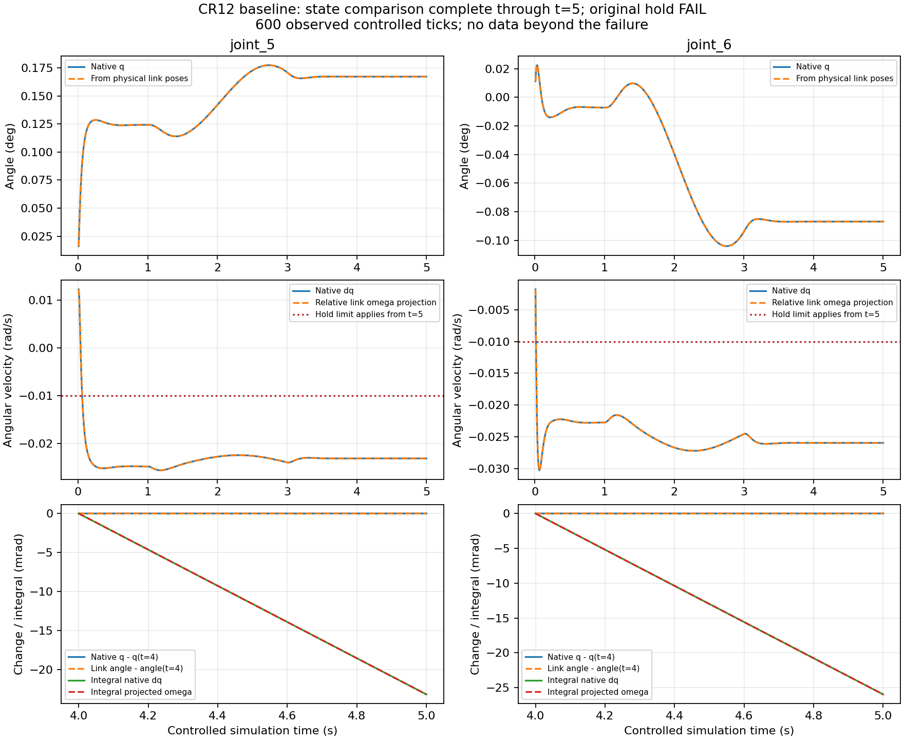

# CR12 关节状态一致性与求解阶段诊断报告

执行日期：2026-09-30，Asia/Shanghai（UTC+08:00）。

状态：**状态对照目标完成；完整关节运动与保持验收仍 FAIL；基本驱动阶段未关闭，等待 GPT/用户审阅及人工可视化反馈。**

路径缩写：仓库为 `E:/Project/IsaacLab_HARL`；T 为 `source/isaaclab_tasks/isaaclab_tasks/direct/scan_mobile_manipulator/`；E 为 `logs/scan_assignment/20260930_cr12_state_consistency/`。下文源码路径以仓库为根；安装根 P 为 `C:/isaacenvs/isaac45_harl/Lib/site-packages/isaacsim/`。

## 1. 结论及授权边界

本轮完成定向核对、小型同刻状态探针、CPU测试及 **1 次真实 GUI/D3D12/cuda:0 诊断**，没有继续PD调参。唯一使用 `T/assets/rokeaCR12/derived/fixed_lift0_v1/usd/cr12_fixed_lift0.usd` 及现有引用层。v1资产、baseline、初始化、目标、物理配置与原验收标准均保留。

| 问题 | 本轮结论 | 证据边界 |
|---|---|---|
| 缓存与随后native q/dq是否不同 | 六轴、600个受控样本，逐值最大差全为 **0** | 先保存验收快照并同步，再读native，不倒置次序 |
| q是否对应实际link相对姿态 | 六轴最大差不超过 **5.302e-7rad** | 实际物理link pose和joint局部frame；未从q生成对照pose |
| dq是否对应父子角速度投影 | 六轴最大差不超过 **4.471e-8rad/s** | 减去非零父角速度，使用parent joint frame世界轴 |
| 速度是否就是位姿轨迹导数 | **不能据此认定**；两条速度通道积分都与位置端差显著不符 | 同一PhysX articulation的不同表达不是独立物理真值 |
| 局部缓存/映射/下发错误 | 本轮**未发现**明确错误 | 不等于所有路径绝无读取问题；本次q/dq和旧baseline完全一致 |
| 原关节运动与保持 | **FAIL**，第600/720步，受控t=5秒；dq5/6为−0.023184916/−0.025973620rad/s | 不以差分、滤波或投影速度替换原dq；601–720未运行 |
| 下一步 | 建议审阅一个外力施加时序的单因素对照 | 本轮未改、更未运行该设置，未确立唯一根因 |

预定对照覆盖运动段及3–4、4–5秒，已完整取得，无需第二次运行。预算实际 **A1/2、B0/1、App1/3**；动作前零受控失败为0，修复重启为0。未用额度不构成继续试验理由。Phase B保持 **COMPLETE / GPT REVIEW PASS / CLOSED**；Windows与v1成果保持接受状态，历次FAIL不回写。

## 2. 状态来源、坐标与实际绑定

### 2.1 本地实现依据

版本来源分别为：`P/../isaacsim-4.5.0.0.dist-info/METADATA:2–3` 的 Isaac Sim **4.5.0.0**；`P/extsPhysics/omni.physx/config/extension.toml:5`、`omni.physics.tensors/config/extension.toml:2` 和 `omni.physx.tensors/config/extension.toml:2` 的扩展 **106.5.7**。精确 PhysX SDK 版本从定向本地元数据未能确定，记 **UNKNOWN**，不把扩展号当SDK号。

以下简称 AD=`source/isaaclab/isaaclab/assets/articulation/articulation_data.py`，AT=`source/isaaclab/isaaclab/assets/articulation/articulation.py`，TensorAPI=`P/extsPhysics/omni.physics.tensors/omni/physics/tensors/impl/api.py`。

| 量 | 实际对象/API及刷新位置 | 坐标/单位 | 缓冲区及数据源 |
|---|---|---|---|
| 原验收q/dq | driver `_joint_state:460`；正常 `sim.step→robot.update(dt)` 后读 `robot.data.joint_pos/joint_vel` | 转轴rad/rad/s；按joint名称索引 | AD `update:78` 推进时戳，joint_acc触发速度刷新；`joint_pos:529/joint_vel:538` 缓存native引用；driver立即转独立CPU list |
| 对照native q/dq | `root_physx_view.get_dof_positions/get_dof_velocities`；TensorAPI:1379/1408 | 同一命名顺序，rad/rad/s | 各getter复用自身返回张量，与AD缓存可同源同buffer；不能把引用当快照 |
| 父子link物理pose | `get_link_transforms`，TensorAPI:1185；每受控步直接读native | 世界link/actor frame，xyz米、四元数 **XYZW**，不是COM pose | 同一articulation原生通道；同步后独立CPU副本；不是USD authored world transform |
| 父子角速度 | `get_link_velocities[...,3:6]`，TensorAPI:1214；AD:928–937 | 世界轴表达，rad/s | 前三维线速度对应COM，角速度无需按COM主轴再旋转；另存独立快照 |
| joint绑定、axis、localPos/localRot | driver `_state_joint_frames:465` 从当前组合stage的 `UsdPhysics.RevoluteJoint` 只读 | body0/body1局部joint frame，位置米，localRot **WXYZ**；axis为joint frame的X/Y/Z | 静态joint定义，不是实际link世界pose；未观测值不补零/FK |
| physics step/time | driver `_clock:456`：`current_time_step_index/current_time` | 原始physics计数和秒，受控时间减初始化基线 | 读块前后记录；另有逐步恰好1tick及render不推进检查 |

AT `body_names:145/joint_names:135` 来自native view的link_names/dof_names。本次映射实际为body 0…6、joint 0…5，但实现按名称定位，不靠这一偶然顺序。当前view的subspace roots为 `/`，来源 `P/exts/isaacsim.core.simulation_manager/isaacsim/core/simulation_manager/impl/simulation_manager.py:126–127`、AT:1149，支持世界坐标解释。

TensorAPI:419–433、1190特别说明的是手动set joint state后link transforms可能需kinematic刷新；本轮受控段没有这种写入，正常physics step后直接getter。探针内**不调用** `update_articulations_kinematic`。原geometry/frame监测的实际路径为driver `_body_poses:303–312` → AD `body_link_pos_w/body_link_quat_w:830–854`，这些pose getter会做kinematic刷新，但不读取或改写速度。本轮没有移动或改变这条原监测路径。另一个未用于探针的完整状态getter `body_link_state_w`（AD:450–468）会把native线速度buffer原位换算至link点；这说明不能混淆各getter语义，不表示原监测实际调用了它。探针直接保存raw link pose/角速度，无新增物理步。

### 2.2 本轮实际joint frame

prim均为 `/World/CR12/joints/joint_i`，body prim为 `/World/CR12/<body>`。六轴 `localPos1=(0,0,0)`、`localRot0=localRot1=(1,0,0,0)`（WXYZ）是本次读回事实。数学实现和CPU测试仍覆盖非单位父frame、非平凡零位旋转及四元数正负号。

| joint | body0 → body1 | axis | localPos0，m（显示舍入） |
|---|---|---|---|
| 1 | agv → link_1 | Z | (0.105,0,1.062) |
| 2 | link_1 → link_2 | Y | (0,0,0.35) |
| 3 | link_2 → link_3 | Y | (0,0,0.76) |
| 4 | link_3 → link_4 | Z | (0,0,0.54) |
| 5 | link_4 → link_5 | Y | (0,−0.15,0) |
| 6 | link_5 → link_6 | Z | (0,0,0.123) |

计算使用实际读回值，不用表中舍入值，例如joint1 z=1.062000036239624、joint5 y=−0.15000000596046448。惯量解释保留已修正的“关于COM、以link/object轴表达的完整张量”；不再正向旋转主轴，原COM/惯量检查未改。

## 3. 本轮实现、同步及CPU检查

| 文件/符号 | 本轮改动 | 保留边界 |
|---|---|---|
| `scripts/environments/run_cr12_joint_drive.py`：`_parse_args:131/_state_joint_frames:465/_solver_observation:491/_probe_state:517/_run_drive:655` | 增加 `--diagnose-state-consistency`，要求baseline和joint trace；同刻对照、只读求解配置、独立关闭/失败结果 | 原入口原场景；验收始终消费正常刷新后的q/dq快照 |
| `scripts/environments/_cr12_hold_diagnostics.py`：`JointTrace/set_state_comparison:181` | 原CSV可选追加native q/dq共12列；未观测留空 | 不重复cached q/dq；原窗口/null/NOT_CHECKED/FAIL粘性保持 |
| `scripts/environments/_cr12_state_consistency.py`：`bind_joint_frames:50/analyze_links:84/snapshot_read:151/StateConsistencyTrace:204` | 按名绑定、相对姿态/速度计算、一个body CSV、对照有效性 | 无目标生成、仿真推进或参数修改 |
| `source/isaaclab_tasks/test/test_cr12_state_consistency.py` | 15项CPU测试，含实际driver函数的fake native接入 | 合成数据只验证逻辑 |
| `E/repro/supervise_cr12_state.py` | 复用Windows Job归属和实时排空；新预算、两类独立结果 | 不改旧监督器，无manual预算旁路 |

实际采样次序：

1. 原physics tick完成、原clock检查、正常 `robot.update(dt)`；记录读块起始clock。
2. 原 `_joint_state` 先把验收q/dq阻塞复制为CPU独立list；原trace先保存取得的验收样本。非有限时原规则立即停止，不继续native探针。
3. 对上述快照建立独立CPU数组，执行 `torch.cuda.synchronize(robot.device)`。
4. 固定次序native q → native dq → link poses → link velocities。每项均为 **getter → device同步 → 独立阻塞CPU副本 → device同步**。没有仅发出clone就当作复制完成，也不猜测原生后端未公开的CUDA stream契约。
5. 结束clock、CPU坐标计算、记录，然后原contact → joint → geometry → frame判据及每两步render。

读块内无step/render/app.update、第二次robot.update、kinematic刷新、reset、target变化或状态回写。第1/120/360/480/600步保留少量快照并复查旧对象，共15条重查全true；600个读块step/time前后完全相同。有限读数差异只记录，不添加位置/速度停止门限；非法state/句柄与原安全失败仍停止。缺失字段留空/null，主异常不被辅助写盘错误覆盖。对照完成要求body CSV真实保存、关闭、无记录错误，不覆盖drive失败。

数学公式：

`Qp=Qbody0·Qlocal0；Qc=Qbody1·Qlocal1；Qrel=inverse(Qp)·Qc`。

从Qrel提取指定axis有符号twist角，处理双覆盖、连续角展开，同时保留swing/off-axis残差。

`a_world=R(Qp)·axis；dq_links=(ωbody1−ωbody0)·a_world`。

固定使用parent一侧的轴，不按误差择优切换；同时记录两侧axis夹角、anchor间距和角速度非轴向残差。

**运行前检查**：解释器实际为 `C:\isaacenvs\isaac45_harl\python.exe`，UTF8=1。五个新增/修改Python文件py_compile通过。新增状态测试 **15/15（root最终0.254秒）**；原HoldDiagnosticsTests **12/12（0.215秒）**；新监督器纯CPU检查 **6/6（最终0.128秒）**。覆盖共享buffer独立快照、名称重排、非单位父frame和非零父角速度、符号/零位/双覆盖、clock不推进、原FAIL及缺失值、native异常叠加记录异常等。

主要实际命令：

```powershell
& 'D:\miniconda3\Scripts\conda.exe' run -p 'C:\isaacenvs\isaac45_harl' python -c "import sys; print(sys.executable); print('UTF8=',sys.flags.utf8_mode)"
& 'D:\miniconda3\Scripts\conda.exe' run -p 'C:\isaacenvs\isaac45_harl' python -m py_compile scripts/environments/run_cr12_joint_drive.py scripts/environments/_cr12_hold_diagnostics.py scripts/environments/_cr12_state_consistency.py source/isaaclab_tasks/test/test_cr12_state_consistency.py logs/scan_assignment/20260930_cr12_state_consistency/repro/supervise_cr12_state.py
& 'D:\miniconda3\Scripts\conda.exe' run -p 'C:\isaacenvs\isaac45_harl' python -B source/isaaclab_tasks/test/test_cr12_state_consistency.py
& 'D:\miniconda3\Scripts\conda.exe' run -p 'C:\isaacenvs\isaac45_harl' python -B source/isaaclab_tasks/test/test_cr12_asset_math.py HoldDiagnosticsTests
```

没有运行全仓库测试、旧资产生成测试或Windows/Phase B验收。运行前局部审查补强失败字段保留、首因保护及完成度检查；这些不是已发生的机器人运行故障。**真实运行后没有源码修复或复测**。

## 4. 唯一真实运行与原判据

工作目录 `E:\Project\IsaacLab_HARL`；HEAD `24ecbad7dd1bdcd006399b64bfb757a86b71aeec`。沿用已接受Windows处理和pre-App CUDA准备，没有重开Windows验证。

### 4.1 实际完整命令

外层已执行命令：

```powershell
& 'D:\miniconda3\Scripts\conda.exe' run --no-capture-output -p 'C:\isaacenvs\isaac45_harl' python -u logs/scan_assignment/20260930_cr12_state_consistency/repro/supervise_cr12_state.py --attempt-dir logs/scan_assignment/20260930_cr12_state_consistency/attempt_01 --usd-path source/isaaclab_tasks/isaaclab_tasks/direct/scan_mobile_manipulator/assets/rokeaCR12/derived/fixed_lift0_v1/usd/cr12_fixed_lift0.usd --pd-profile baseline --record-joint-trace --diagnose-state-consistency
```

监督器实际创建的目标命令：

```powershell
& 'D:\miniconda3\Scripts\conda.exe' run --no-capture-output -p 'C:\isaacenvs\isaac45_harl' python -u scripts/environments/run_cr12_joint_drive.py --usd-path E:\Project\IsaacLab_HARL\source\isaaclab_tasks\isaaclab_tasks\direct\scan_mobile_manipulator\assets\rokeaCR12\derived\fixed_lift0_v1\usd\cr12_fixed_lift0.usd --physics_steps 720 --output-dir E:\Project\IsaacLab_HARL\logs\scan_assignment\20260930_cr12_state_consistency\attempt_01 --device cuda:0 --pd-profile baseline --record-joint-trace --diagnose-state-consistency --info
```

实际解释器/UTF8如第3节；experience为 `E:\Project\IsaacLab_HARL\apps\isaaclab.python.kit`。子进程继承环境副本，仅明确HEADLESS/ENABLE_CAMERAS/LIVESTREAM/XR=0。Kit参数由原helper补缺省D3D12。日志 `kit_20260930_093655.log:2682/3329` 分别为DX12/D3D12，RTX4060Ti、driver610.60；不以参数false代替实际后端证据。

### 4.2 配置、退出与覆盖

baseline K=`(200,4000,2000,200,1000,150)`，D=`(20,550,166,12,37,7)`；effort=`(20,60,30,10,10,5)Nm`，速度限制0.2rad/s。GUI/cuda:0、dt=1/120、render_interval=2、gravity=(0,0,−9.81)、GPU pipeline/dynamics配置读回true、TGS、articulation 8/2均保留。关节张量实际在cuda:0；配置读回层级见第7节。

原0–1秒保持、1–3秒joint2五次轨迹0→5°、3–6秒保持；同时提交位置及解析速度，其余目标0。误差≤0.5°、速度≤0.25rad/s；t≥5速度≤0.01rad/s。原硬限位及1e-3rad容差、t2至少1°进展、6秒q2≥4.5°、root漂移≤1e-4m/rad、固定frame≤1e-5、禁止接触>0.1N停止等均保持。无teleport、受控状态回写、补偿、延长settle或放宽接触。

| 项目 | 本次事实 |
|---|---|
| 时间/PID | 2026-09-30 **09:36:48.086 → 09:37:56.929 +08:00**；supervisor30848、Conda16624、Python31828 |
| App/全树耗时 | **33.313 / 68.844秒**，低于180/360秒；所属Job在子进程恢复前建立，输出持续排空 |
| 退出 | Python0 / 内层Conda0 / 外层监督1；自然退出，无超时、强杀或遗留所属进程，无原生GPU故障证据 |
| 初始化 | reset引入2步/0.01666666753590107秒，单列；1次初始joint-state写入、0次root-state写入，无额外settle |
| 受控范围 | **600步、5.000000260770321秒**；299次render，600次实际target核对 |
| 停止原因 | t=5首次严格保持判据触发，joint5/6速度超限；失败步数据先保留再停止 |
| 状态对照 | body CSV600行（1…600），joint CSV601行（0…600）；两表实际时间相同，600读块clock不变 |
| 原检查 | clock/contact各600 PASS；joint599 PASS，第600步1次FAIL；geometry/frame599 PASS，第600 NOT_CHECKED |
| 原严格保持窗口 | 600…720应有121样本，实际 **1/121、complete=false**，失败样本计入极值 |
| 接触/固定关系 | 7传感器各600次刷新，已观测禁止接触最大0N；已检查root/frame漂移0；arm几何守卫最低z=1.2399987636131602m |
| 两种结果 | `state_comparison_complete=true`；`work_completed=false/diagnostics_complete=false/drive_acceptance_pass=false` |

无6秒终态。最后render为第598步、受控参考t=4.983333…秒，不能标第600步或6秒终点。没有为截图补步或另开App；正文图片是CSV分析曲线，**不是GUI截图或虚构效果图**。

与旧 `logs/scan_assignment/20260929_cr12_hold_diagnosis/attempt_01/` 独立比较：601行q/dq/两类target共 **14,424个标量逐值相同**；三个时间列及原检查状态也完全相同。参数读回、初始化、派生URDF签名等对应字段一致。未观测到加探针改变原轨迹或验收结果，但不扩成其他配置/平台的确定性保证。

## 5. 同刻状态对照结果

覆盖受控step1…600。表中最大值取全部样本，不设新通过阈值。所有q/dq有限，原验收始终用正常缓存快照。

| 轴 | max缓存/native q差rad / dq差rad/s | max link角/native q差rad | max投影/native dq差rad/s | max off-axis旋转rad | max两侧轴夹角rad |
|---|---:|---:|---:|---:|---:|
| 1 | 0 / 0 | 3.736313e-7 | 3.725290e-9 | 4.260836e-8 | 4.470348e-8 |
| 2 | 0 / 0 | 4.936847e-7 | 4.470145e-8 | 2.008586e-8 | 3.942477e-8 |
| 3 | 0 / 0 | 3.366732e-7 | 2.471705e-8 | 1.523421e-8 | 3.332001e-8 |
| 4 | 0 / 0 | 3.699818e-7 | 8.313187e-9 | 2.674089e-8 | 3.650024e-8 |
| 5 | 0 / 0 | 3.013250e-7 | 3.435635e-8 | 1.550235e-8 | 3.332001e-8 |
| 6 | 0 / 0 | 5.301669e-7 | 2.517636e-8 | 1.223706e-7 | 1.219713e-7 |

全轴最大anchor间距 **6.681349e-7m**，角速度非轴向残差最大 **6.328954e-6rad/s**，均保留而非设零。float32物理pose经相对旋转重建有约1e-7rad数值分辨率限制，不能把微小端差的所有有效数字当作独立物理精度。

第600步joint5父link4世界角速度为 `(0.0005981423,−0.0037998911,0.0120862704)` rad/s，joint6父link5为 `(0.0006556043,−0.0269847270,0.0120810140)` rad/s，两者均非零。按实际parent世界轴得到dq投影 **−0.0231849076 / −0.0259736230rad/s**，与native **−0.0231849160 / −0.0259736199** 相符。没有把局部Y/Z当固定世界轴，没有忽略父角速度。

**同源限制**：AD与native关节getter共用广义状态和可复用buffer；link通道同属PhysX articulation。官方说明link位置由关节坐标生成，所以link姿态反解检查的是映射及状态表达相容性。安装的原生实现不可见，不能据此证明本机各getter内部计算阶段。[PhysX 5.3 articulation说明](https://nvidia-omniverse.github.io/PhysX/physx/5.3.0/docs/Articulations.html) 是体系参考，版本匹配未证实。两种对照都**不能证明dq等于观测位姿轨迹的导数**。

## 6. 位姿变化与速度积分

积分全部使用实际physics时间的梯形法。运动段采用闭区间step120…360（241样本）以含1秒起点；原验收窗口仍121…360（240样本），没有改写。运动段实际时长为2.0000001043081284秒；3–4、4–5秒两个保持区间各121样本、各1.0000000521540642秒。不以参考时间或wall time替代。

### 6.1 重点轴5/6

单位均rad，残差=`Δq−∫dq dt`。缓存q端差和native逐值相同，缓存dq积分也完全相同。

| 区间 | 轴 | 样本 | native Δq | native ∫dq | Δq−∫dq | link角端差 | link投影∫ω |
|---|---:|---:|---:|---:|---:|---:|---:|
| 运动 [1,3] | 5 | 241 | 8.175827e-4 | -4.725643e-2 | 4.807402e-2 | 8.175721e-4 | -4.725642e-2 |
| 运动 [1,3] | 6 | 241 | -1.514458e-3 | -5.035433e-2 | 4.883987e-2 | -1.514464e-3 | -5.035432e-2 |
| 保持 [3,4] | 5 | 121 | -6.845943e-5 | -2.325242e-2 | 2.318396e-2 | -6.853809e-5 | -2.325242e-2 |
| 保持 [3,4] | 6 | 121 | 1.246687e-4 | -2.584896e-2 | 2.597363e-2 | 1.247028e-4 | -2.584895e-2 |
| 保持 [4,5] | 5 | 121 | 1.306180e-7 | -2.318478e-2 | 2.318491e-2 | 3.810611e-7 | -2.318478e-2 |
| 保持 [4,5] | 6 | 121 | -1.522712e-7 | -2.597377e-2 | 2.597362e-2 | -4.176790e-7 | -2.597377e-2 |

4–5秒轴5/6的native dq标准差仅 **2.744762e-7 / 3.087530e-7rad/s**，持续为负，不是持续换号的周期振荡。native位置端差约1e-7rad、link角端差约4e-7rad，而两种速度积分均约−0.02318/−0.02597rad。这个多数量级差异仍存在，不能只用“离散积分误差”或float32舍入解释。

### 6.2 全六轴4–5秒

| 轴 | native Δq | native ∫dq | Δq−∫dq | link角端差 | link投影∫ω |
|---|---:|---:|---:|---:|---:|
| 1 | 3.630121e-7 | 5.992161e-3 | -5.991798e-3 | 3.745736e-7 | 5.992159e-3 |
| 2 | 1.117587e-7 | -1.313070e-3 | 1.313182e-3 | 3.862222e-7 | -1.313070e-3 |
| 3 | 3.101304e-7 | -2.486485e-3 | 2.486796e-3 | 3.720353e-7 | -2.486484e-3 |
| 4 | 3.816094e-7 | 6.124077e-3 | -6.123696e-3 | 3.745523e-7 | 6.124075e-3 |
| 5 | 1.306180e-7 | -2.318478e-2 | 2.318491e-2 | 3.810611e-7 | -2.318478e-2 |
| 6 | -1.522712e-7 | -2.597377e-2 | 2.597362e-2 | -4.176790e-7 | -2.597377e-2 |



上排为native q与实际link姿态反解角，中排为native dq与父子角速度投影，下排为4–5秒位置变化及两种速度积分。曲线未滤波。红色−0.01参考线只表示**从t=5起**适用的下界，不能据此重判此前样本。5秒后没有数据，不延长曲线、不分析不存在的5–6秒趋势。

## 7. 求解阶段证据与唯一下一步建议

### 7.1 当前只读求解配置

driver `_solver_observation:491` 在physics初始化后读取组合USD schema，同时记录authored opinion。下表不是native每步迭代数，也不是内部速度阶段追踪。

| 属性 | 本轮resolved值 | authored | 来源 |
|---|---:|---|---|
| `/physicsScene.physxScene:solverType` | TGS | true | scene schema，原PhysicsContext getter也读该属性 |
| scene position min/max | 1 / 255 | true / true | min/maxPositionIterationCount |
| scene velocity min/max | 0 / 255 | true / true | min/maxVelocityIterationCount |
| `/World/CR12/root_joint` position/velocity iterations | 8 / 2 | true / true | PhysxArticulationAPI |
| scene `enableExternalForcesEveryIteration` | **false** | **false** | 本轮实际resolved值，与本地schema fallback一致 |
| scene `enableStabilization` | true | true | 本轮未修改 |
| articulation sleep threshold | 4.999999873689376e-5 | false | fallback，不代表观察到sleep |
| articulation stabilization threshold | 9.999999747378752e-6 | false | fallback，不代表观察到stabilization作用 |

本地 `source/isaaclab/isaaclab/sim/simulation_cfg.py:46–83` 说明scene对actor最高迭代请求施加min/max限制；`simulation_context.py:689–693` 写入范围。`source/isaaclab/isaaclab/sim/schemas/schemas.py:75–77` 说明articulation设置优先于link rigid-body设置。8/2在当前clamp内，未发现配置层覆盖成其他值的证据；**精确native实际迭代数与各阶段q/dq未取得，保持UNKNOWN**。

`P/extsPhysics/omni.usd.schema.physx/plugins/PhysxSchema/resources/schema.usda:318–325` 已存在外力逐迭代选项，不是把新版字段引入旧安装。`P/exts/isaacsim.core.api/isaacsim/core/api/physics_context/physics_context.py:466–477` 的solver getter，以及GPU dynamics getter最终也是USD读回。实际cuda:0张量、受控physics时钟及同次日志提供运行证据，但配置getter不等于内部GPU kernel或求解阶段测量。

### 7.2 机制假设与版本限制

官方PhysX **5.4.0** 文档说明，缺省外力/重力每次simulate开始施加一次；开启逐TGS位置迭代选项后按内部子步分配，也会改变自由落体积分行为。[官方scene flag说明](https://nvidia-omniverse.github.io/PhysX/physx/5.4.0/_api_build/struct_px_scene_flag.html)

官方 **5.8.0** 的 *TGS Steady-State Velocity and Position Discrepancy* 专节解释：外力和drive的子步时序不同，可以出现位置趋稳但报告速度非零；articulation的Coriolis项又不完全等价于逐子步重算。[官方TGS稳态差异说明](https://nvidia-omniverse.github.io/PhysX/physx/5.8.0/docs/Simulation.html#tgs-steady-state-velocity-and-position-discrepancy)

这是**相符且可检验的机制线索**，不证明安装SDK与5.8一致，也不证明本机原生分支正是该实现。没有取得position阶段推进速度、最终输出阶段、逐迭代外力或native实际驱动力矩，不能宣称唯一根因、GPU/求解器缺陷、饱和或PD错误；也不把一般velocity iteration描述升级成修改8/2的动作。

### 7.3 唯一建议：待审单因素对照

| 项目 | 建议（**尚未实现、尚未运行**） |
|---|---|
| 唯一设置 | scene `physxScene:enableExternalForcesEveryIteration`：当前resolved **false → true** |
| 落点 | 经后续授权，在同一drive场景创建后、首次physics初始化/reset前，用本地PhysxSceneAPI作一次scene层override，读回true/authored并记录；不保存USD |
| 理由 | q/native/link姿态各自相符，dq/native/link角速度各自相符，积分差异仍在；该flag针对外力与drive子步时序，辨识力高于继续PD扫描 |
| 保持不变 | v1、baseline K/D、dt1/120、TGS8/2、重力、effort/velocity、碰撞、sleep/stabilization、初始化、原720步序列及0.01速度判据、状态探针 |
| 区分结果 | 若dq与位置积分差异明显下降，支持时序假设；若无明显变化则削弱假设，再查本地SDK/原生阶段；仍单独报告原验收 |
| 风险 | 改变整个scene的积分及接触响应，不是修读数；保留原碰撞/几何/root/frame守卫，不保证通过 |
| 撤销 | 独立进程退出，不持久化资产/共享配置；后续override显式可关闭，下一进程恢复本次false基线 |
| 后续预算 | 另行批准；以本次baseline为对照，不自动再启动、不同时调PD或改迭代数 |

本轮进入“原生表达相容，但位置变化与速度积分差异持续”的调查分支。没有证实需要修复后复测的读取缺陷，也没有必要采样缺口。**本轮不执行上述配置对照。**

## 8. 人工可视化检查

状态：**待用户确认**。以下命令基于当前已实现CLI，使用同一drive入口、v1、baseline及原停止判据。新manual时间戳目录不覆盖自动attempt_01；入口拒绝覆盖已有result。Codex未为演示额外执行此命令。

```powershell
Set-Location -LiteralPath 'E:\Project\IsaacLab_HARL'
$cr12ManualOut = 'logs/scan_assignment/20260930_cr12_state_consistency/manual_' + (Get-Date -Format 'yyyyMMdd_HHmmss_fff')
& 'D:\miniconda3\Scripts\conda.exe' run --no-capture-output -p 'C:\isaacenvs\isaac45_harl' python -u scripts/environments/run_cr12_joint_drive.py --usd-path source/isaaclab_tasks/isaaclab_tasks/direct/scan_mobile_manipulator/assets/rokeaCR12/derived/fixed_lift0_v1/usd/cr12_fixed_lift0.usd --physics_steps 720 --output-dir $cr12ManualOut --device cuda:0 --pd-profile baseline --record-joint-trace --diagnose-state-consistency --info
```

指定Conda环境当前已核对UTF8=1。入口要求GUI/cuda:0、无扫描相机；非零HEADLESS等冲突会被拒绝，不静默换模式。此直接人工命令有原步数/失败停止逻辑，**不附带自动诊断监督器的180/360秒Job watchdog**。异常停留或窗口关闭均不能当通过，不通过暂停/恢复凑步数。

沿用spectator viewport `eye=(3,−3,2.4), target=(0,0,1)`，供整体观察底盘、臂和扫描头。本轮未改视角、物理模型或创建扫描相机。GUI加载后自行开始原序列，不是打开裸USD再按Play：

- 初始约1秒保持；
- joint2在1–3秒内小幅运动至目标5°，其余轴目标0；
- 继续保持，当前可能在t=5因轴5/6速度失败而退出，不承诺6秒。
- 控制台 `physics_ready/controlled_step_begin` 表示初始化/动作开始，每120步 `drive_progress` 给受控时间；`work_failed` 需结合result判断，原生close后的exit0不代表成功。

人工重点确认装配比例/安装方向、底盘/机械臂/扫描头随动、明显跳变或穿插、可见漂移/抖动。不要拖关节滑块、移动模型、修改物理参数或暂停/恢复凑满步数。观看过快可用已有系统录屏回看，不改dt、不延长保持或开发录像系统。**画面正常不代表0.01rad/s保持、惯量真实性或完整碰撞安全通过。** 用户反馈前人工检查不填PASS。

## 9. 交付、限制及停止

本轮定向阅读适用AGENTS、TASK_PROGRESS、REPORT_INDEX、前次保持报告第2/5/6/8节、实施报告的资产/惯量修正/原场景判据，以及指定baseline结果/CSV和attempt_03补丁。检查本地API、schema、包元数据及少量官方资料；未扫描全盘或历史日志全集。数值分析/绘图离线进行，没有创建第二个App。

新增/修改限于第3节五个Python文件、本报告及一张CSV图、小范围TASK_PROGRESS/REPORT_INDEX更新，以及E下监督/运行证据。`implementation.patch` 仅保存本轮对既有drive/hold两文件的增量；新模块/测试/监督器按实际路径阅读，不复制整套源码包。**AgentRead当日目录只有Markdown和正文图片，没有新增Python文件。**

源码文本比对确认 `check_joint_sample/_read_physics/_calibrate_root_anchor/_capture_submitted_targets/_check_geometry/_check_contacts/_check_frames/_joint_state` 与本轮开始前一致。机器人配置、原资产数学模块、生成器、Windows helper及入口、框架、installed packages未修改。保留已有dirty worktree及既有暂存ZIP删除；本轮结束HEAD不变，未执行Git写操作。logs受原忽略规则影响，目前主要在本机工作区可取，新checkout不自动包含；未生成ZIP或全仓库hash清单。

未改solver/迭代/dt/PD/重力/外力flag/sleep/stabilization、摩擦或armature；未导入/生成/保存资产，未实现相机/IK/规划/双视点/MRTA，未训练或操作checkpoint/实体设备；已删除USD及历史数据不恢复。

下一步仅为：**GPT/用户审阅本报告，并按第8节人工查看反馈，再决定是否另行授权第7.3节单因素对照。基本驱动仍未关闭。** 不自动开始solver试验、PD调参、后续机器人执行阶段或Git提交。

## 辅助证据对应表

| 结论/检查项 | 文件位置 | 关键字段/定位 | 用途及限制 |
|---|---|---|---|
| 原判据、probe顺序 | [drive源码](../../../../../../../../scripts/environments/run_cr12_joint_drive.py)、[本轮增量](../../../../../../../../logs/scan_assignment/20260930_cr12_state_consistency/attempt_01/implementation.patch) | 第3节符号，`_run_drive/main` | 源码事实；增量不含新模块或历史dirty修改 |
| 数学、复制、记录与CPU逻辑 | [状态模块](../../../../../../../../scripts/environments/_cr12_state_consistency.py)、[关节记录](../../../../../../../../scripts/environments/_cr12_hold_diagnostics.py)、[CPU测试](../../../../../../../../source/isaaclab_tasks/test/test_cr12_state_consistency.py) | `analyze_links/snapshot_read/summary` | 合成测试不代替真实运行 |
| 实际q/dq及FAIL样本 | [joint_trace.csv](../../../../../../../../logs/scan_assignment/20260930_cr12_state_consistency/attempt_01/joint_trace.csv) | 601行，新增native列，step600 checks | 一份关节数据，未过滤 |
| link状态及同刻clock | [body_state_trace.csv](../../../../../../../../logs/scan_assignment/20260930_cr12_state_consistency/attempt_01/body_state_trace.csv) | 600行，XYZW pose/world omega/derived/clock/valid | 七个相关body及必要派生量，不是全场景dump |
| 参数、绑定、覆盖、两类结果 | [result.json](../../../../../../../../logs/scan_assignment/20260930_cr12_state_consistency/attempt_01/result.json) | `solver_observation/state_consistency/physx_readback/joint_diagnostics_summary/failures` | schema与native参数读回层级分开 |
| 命令、进程及预算 | [command.json](../../../../../../../../logs/scan_assignment/20260930_cr12_state_consistency/attempt_01/command.json)、[supervisor_result.json](../../../../../../../../logs/scan_assignment/20260930_cr12_state_consistency/attempt_01/supervisor_result.json)、[监督器](../../../../../../../../logs/scan_assignment/20260930_cr12_state_consistency/repro/supervise_cr12_state.py) | A1/B0，180/360，exit，两类completion | 一次性repro在logs，exit0不覆盖FAIL |
| 同次启动与退出 | [console.log](../../../../../../../../logs/scan_assignment/20260930_cr12_state_consistency/attempt_01/console.log)、[events.jsonl](../../../../../../../../logs/scan_assignment/20260930_cr12_state_consistency/attempt_01/events.jsonl)、[Kit日志](../../../../../../../../logs/scan_assignment/20260930_cr12_state_consistency/attempt_01/kit_20260930_093655.log) | Kit2682/3329，physics_ready/work_failed/app_close_begin | 原生本机日志位置由result记录，保留同次副本 |
| 原baseline及历史FAIL | [上轮主报告](../20260929/CR12_HOLD_DIAGNOSIS_AND_PD_RETEST_REPORT.md)、[旧baseline CSV](../../../../../../../../logs/scan_assignment/20260929_cr12_hold_diagnosis/attempt_01/joint_trace.csv) | 同601行逐值比对 | 保留历史，不重跑不覆盖 |
| 当前交接 | [TASK_PROGRESS](../../TASK_PROGRESS.md)、[主题导航](../../REPORT_INDEX.md) | 本轮摘要、机器人主题 | 不自动授权下一阶段 |

