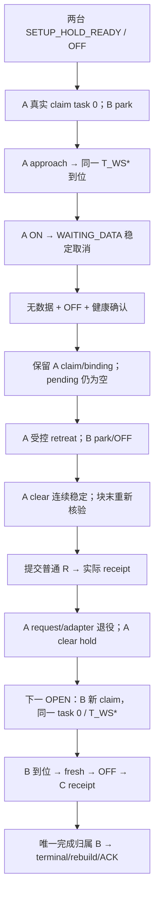

# CR12 真正共享视点的物理可行性与跨机器人转交最小方案

日期：2026-10-08，Asia/Shanghai（UTC+08:00）。状态：**定向源码分析及纯 CPU 离线设计；等待 GPT/用户审阅。App 0。共享任务转交尚未实施、尚无 runtime PASS。**

路径缩写以仓库 `E:/Project/IsaacLab_HARL` 为根：

- T = `source/isaaclab_tasks/isaaclab_tasks/direct/scan_mobile_manipulator/`
- E = `scripts/environments/`，Q = `source/isaaclab_tasks/test/`
- L = `logs/scan_assignment/20261008_cr12_shared_task_plan/`
- P = `C:/isaacenvs/isaac45_harl/python.exe`；Conda = `D:/miniconda3/Scripts/conda.exe`。

## 1. 结论、接受基线与证据层级

**推荐一个新固定 E1/M2/N1 profile：相向、错开 0.30 m 的两台固定 CR12，使用非零停泊构型，共享唯一 task 0 和唯一冻结 scanner 世界位姿。A 先接近、稳定等待采集时取消；确认无数据和 OFF 后仍持有原 claim，受控退回 park；实际 clear 稳定后才提交真实 R。receipt 后退役，下一合法 OPEN 才由 B 认领同一 task、同一位姿并取得 fresh 数据。**

本次已找到具体的全 SE(3) 解、接近/退出关节路径和有保持邻域的几何分离依据。新路径主要需要 joint_2 / joint_5 各 28° 的有限运动。当前 4 秒直线位姿参考和原 ±5° profile 不能直接执行它；16 秒候选也被完整原监视器拒绝。唯一一次有推导依据的24秒FK参考检查中，三段均在理想运动学模型里25秒到位，保留原命令/到位监视器通过；这不是实际驱动验证。所需最小补充是显式的新路径参考/预算、非零初态稳定准入、保留绑定的退出收尾，以及固定 M2/N1 的接线。**没有理由先引入通用规划器、移动底盘、第二套 Host/authority 或调整资产参数。**

结论分类：

| 层级 | 本轮结论 |
|---|---|
| 用户已确认 | 分区 E1/M2/N4 错峰正常 case 已获 GPT/用户报告级审阅通过；窗口定向诊断停止 |
| 既有真实运行 | 双机各自 Camera/product、共同 clock/authority、四 fresh/OFF、终态与自然退出已在旧局部场景验证 |
| 本轮源码直接确认 | 固定 M2/N1、非零初始化、长路径及“OFF 后仍绑定退出”尚无现成完整接线 |
| 本轮离线计算 | 两台 FK 与同一目标吻合；具体顺序路径及有限关节邻域可分离；六轴简化负载低于现 effort 限制 |
| 设计建议 | 本文布局、关节路径、新 profile、退出阶段、预算与未来有界验证 |
| 仍需真实验证 | 新构型 PD 保持、实际跟踪/碰撞/接触、native Jacobian、采集取消竞争、跨机 receipt/terminal |

旧 [双机启动诊断及成功复测](CR12_DUAL_GUI_STARTUP_DIAGNOSIS_AND_RETEST_REPORT.md) 的接受范围：native 1440×900 / D3D12；118 transitions、1416 受控 physics、708 render，初始化 2 步另计；四份 fresh RGBA、独立 OFF、1128 tick 运动重叠、72 tick 错峰；共同终态累计 [2,2]、143 维 sidecar、rebuild/ACK。App 构造 26.438 秒、全树 202.672 秒、自然 exit 0。该结果来自上轮，本轮没有重跑。显式 `scaleToMonitor=false / dpiScaleOverride=1.0` 仅保留为成功启动条件，不推广默认、不再调查唯一根因。

只读 HEAD 为 `a8c618a32da65747827f1cb3f722fac24df2aec8`，分支 main。双机和启动修改以及三份旧报告/相关测试原已 dirty/untracked；本轮未撤销、提交或据此阻断工作。Phase B 保持 **COMPLETE / GPT REVIEW PASS / CLOSED**；旧 raw/checkpoint 清理边界不变。

## 2. 一个可复算的布局、初态与唯一共享目标

### 2.1 资产和坐标来源

未来唯一物理来源仍为：
`T/assets/rokeaCR12/derived/fixed_lift0_v1/usd/cr12_fixed_lift0.usd` 及现有引用层。

本轮数学直接读取对应
`T/assets/rokeaCR12/derived/fixed_lift0_v1/cr12_fixed_lift0.urdf`、
`T/assets/rokeaCR12/model/*_collision.obj` 的十份 collision，以及已接受的质量、COM、惯量与安装关系。没有启动 USD importer/Kit、没有转换或修改模型。URDF SHA-256：
`7d634068fe6766828811a69d3741dab7d4be67196be2ae1dac2344b004cb0fc9`。定向读取的 URDF + 十份碰撞文件内容前后未变；这不是全仓库资产审计。

`E/_cr12_pose_control.py:331` 的 `KinematicModel` 用 URDF 核对固定链；六轴方向依次为 Z、Y、Y、Z、Y、Z，原点链见同文件 `_ORIGINS/_AXES:25–26`。世界单位 m、右手系、Z 向上；矩阵 T_AB 表示 B 在 A 中的位姿，四元数 WXYZ。root 是固定 agv LINK frame，不是相机或 COM。

### 2.2 冻结数值

关节向量顺序均为 `[joint_1, joint_2, joint_3, joint_4, joint_5, joint_6]`，下表单位 **度**。内部计算使用 rad。

| 参数 | A / robot 0 | B / robot 1 |
|---|---|---|
| root world xyz，m | (0, 0, 0.053) | (1.098338575415, -0.300000000000, 0.053) |
| root yaw | 0° | 180° |
| root WXYZ | (1,0,0,0) | (0,0,0,1) |
| q_initial = q_park | [0,-16,20,0,-4,90] | [0,-16,20,0,-4,-90] |
| q_goal | [0,12,20,0,-32,90] | [0,12,20,0,-32,-90] |
| q_clear | 与 A park 相同 | 本次 B 无须退出；其可选 park 与初态相同 |
| 全序列相对初始锚最大名义偏移 | [0,28,0,0,28,0]° | [0,28,0,0,28,0]° |
| 全路径最小硬限位裕量 | 1.483503673 rad，约 85° | 同左 |

冻结 **global task_id = 0**，目标是 scanner frame S：

```text
T_WS* =
[ -0.7071067811865477   0.7071067811865474   0   0.5491692877074279 ]
[ -0.7071067811865474  -0.7071067811865477   0  -0.1500000000000000 ]
[  0                    0                   1   2.7893381484821624 ]
[  0                    0                   0   1                  ]

position m = (0.5491692877074279, -0.15, 2.7893381484821624)
WXYZ       = (0.3826834323650896, 0, 0, -0.9238795325112868)
```

独立 FK 复核：A 位置/旋转误差 0/0；B 为 2.289e-16 m / 2.220e-16 rad。角误差按旋转差计算；四元数正负等价，不以元素相等替代姿态一致。

这不是任意 SE(3) 反算底盘：取 a=12°、b=20°、w=90°，
`q_A=[0,a,b,0,-a-b,w]`，
`q_B=[0,a,b,0,-a-b,w-180°]`，
`x=.105+.76 sin(a)+.54 sin(a+b)`；
只把 B root 放在 `(2x,-.30,.053)`、yaw π。两台正常落地、无倾斜/升降。相向 root 与末轴差 180° 抵消，得到相同的完整 E/S 世界姿态。

目标在初始化前一次冻结；未来核对两台实际 root/初态后统一装入。实际误差超准入阈值应拒绝初始化，不能分别从 actual 生成“修正共享目标”或随 owner 改目标。

### 2.3 S、E、C 和非物理 fixture

`E/_cr12_pose_control.py:175–191`：T_ES 为 Rz(135°)、平移零；E 是 link_6，S 是 scanner 安装 frame。源 mesh 的 0.001 scale 和 scanner 的 135° 已各应用一次，body-local collision 不再重复旋转。

`E/_cr12_camera_mount.py:21,36–46,66–116`：

- T_SC 的旋转为 I，平移 m 为 (0.168921722410, -0.129429244995, 0.192403900145)。
- `T_WC_world = T_WS* × T_SC`；world 风格 +X forward/+Z up。
- USD Camera 采用 -Z forward/+Y up，右乘
  `[[0,0,-1],[-1,0,0],[0,1,0]]`；不能只因四元数顺序一致就省略光轴转换。
- 两台保持同一固定 T_EC 各自挂在 link_6，各有独立 Camera/product；不单独移动相机到目标。

现 `nominal_fixture_pose:110` 从零关节/旧小目标生成板位置，`create_camera_and_fixture:127` 还会拒绝已存在的 fixture prim。新 profile 拟增加一次显式的共享非物理板创建/合法复用：位置为
`T_WS* × T_SC × Trans(camera_world_style_X=0.5m)`，
两相机使用同一板；不重叠创建两块板，不把板加入真实构件碰撞验收。板只用于已有 640×480 virtual RGBA 接口，不增加成像质量门槛。

## 3. 有界搜索、几何证据与负载

### 3.1 搜索预算和失败候选

没有全网格、随机多起点或数值 IK 优化；采用上述解析构型族、纯 CPU FK/Jacobian/包络核对。主要种子共 **24 组**，每组初始评估后最多两轮局部细化：

| 族 | 十二个 (a,b) 度种子 | 有限细化与结果 |
|---|---|---|
| 近直臂 | (20,0),(25,-5),(25,0),(30,-10),(30,-5),(35,-15),(35,-10),(40,-20),(40,-10),(45,-25),(45,-15),(50,-25) | wrist A90/B-90，park 差 8°→15°；未得到合格顺序几何候选 |
| 弯肘减肩负载 | (12,20),(10,25),(15,15),(8,30),(12,25),(15,20),(10,28),(14,18),(16,15),(18,12),(14,22),(18,15) | wrist A45/B-135，park 差 22°→28°；未得到合格候选 |
| 只细化第二族首个 seed 12 | 仍 (12,20)，仍 park 差 28° | 第二轮改 wrist 为 A90/B-90；得到本文候选，无新增主要种子 |

最接近的旧 wrist45 候选 cross 已分离，但本机 link_4/link_6 包络精化 gap=-5.1294 mm，属于**几何未解**，不是已证明 mesh 实际相交；该结果没有被忽略。改变腕部朝向后在同一布局族得到最终分离。搜索脚本记录effort占比并用于几何合格候选的排序，没有effort超限自动拒绝分支；最终推荐候选另经全路径六轴负载核对。未采用降低质量/提高effort的方法。

最终候选用 201 点细化几何；对同一冻结候选补充四元数/限位/输入签名不是新布局搜索。解析解的数值 IK 迭代数为 0。第 4 节另有明确上限的名义控制滚动，用于判断参考接口，不是继续搜索布局。

### 3.2 必须覆盖的实际顺序

每台十份 collision；本机 45 shape pairs，其中原同 aggregate/相邻 body 共 13 例外，32 禁止对。跨机 10×10=100 对全部检查，**无同名或相邻豁免**。原世界轴 2 mm 余量保留。

路径以同一 quintic 标量参数插值：
`q(u)=q_start + (10u³-15u⁴+6u⁵)(q_end-q_start)`，u∈[0,1]。

| 阶段 | 活动机器人 | 等待机器人 | 名义关节变化 |
|---|---|---|---|
| 初始/共同 park | 两台固定 park | 两台相机 OFF | 无 |
| A approach | A park→goal | B park/OFF | A 轴2 +28°、轴5 -28° |
| A 到位、取消与确认 OFF | A goal 严格保持 | B park/OFF | 无路径推进 |
| A retreat | A goal→park/clear | B park/OFF | A 轴2 -28°、轴5 +28° |
| R receipt 后、B approach | B park→goal | A clear/OFF | B 轴2 +28°、轴5 -28° |
| B fresh/OFF/terminal | B goal 保持 | A clear/OFF | 本次不额外要求 B 返回 |

不检查 Agoal/Bgoal 同时占据作为通过条件；那是禁止访问状态，会使两套 scanner 占据同一空间。也不把两条互斥活动路径做全部进度笛卡尔积；第 5 节明确由真实 claim 保留和 clear/R 门槛阻止重叠进入。

### 3.3 名义采样及保持邻域

| 项目 | 离线结果及含义 |
|---|---|
| 三物理段各 201 点 | self/ground/cross 未解或拒绝均 0；A retreat 是同一构型曲线反向 |
| 名义最小 self 分离 gap | 14.99181 mm（已按既有包络/2mm语义） |
| 名义最小 cross gap | 40.338575 mm，瓶颈为固定 agv/agv；原 gap=44.338575 mm，已扣双方各2mm，不能再重复扣 |
| 名义 arm 最低 Z | 1.239999229 m；正常底盘地面支撑沿用原例外 |
| 旧 self AABB 逐点复核 | 三段×201点×两台，拒绝样本/拒绝 pair 均0 |
| 旧 cross AABB 逐点复核 | 每段拒绝样本0；不是仅靠整机包络判断 |
| 持续邻域证书，固定 root | buffered self 最小11.806374 mm；cross最小40.338575 mm；arm Z≥1.235937176 m |
| 初始化尚未写非零 q 前的零位 | 两台 self 各32禁对全AABB分离、最小14.88842mm；cross100对全分离；arm Z=1.239999229m |

邻域证书不是“201点没碰所以全程安全”：201 个均匀 joint-line 样本的半间隙为运动轴各 0.07°，加各轴 0.5° 的实际路径/等待偏差。对 body 点用保守杠杆长度乘角变化界，扣除样本间隙和偏差造成的最大投影位移；self 对抵消公共上游刚体运动，另补偿世界 2mm cube 随方向的投影变化；cross 扣两台各自位移界。既有 `E/_cr12_collision_refinement.py:92,176,278` 提供 box/SAT 与已接受输入。

**活动方必须存在同一个 u，使全部六轴同时处在批准 q_witness(u)±0.5° 内；等待方围绕固定 park±0.5°。** 不能每轴选不同 u，也不是强迫 actual 跟随同一时刻的 q_ref——DLS 有时间滞后。现有 2mm/.25° pose 容差不保证这个关节邻域，未来须新增 actual 路径管道守卫。q_cmd 的重力补偿可能超出该窄管道，应另外对下发命令、现有中间预测和 actual 做原几何检查，不能把 nominal command=actual 的假设推广到 PhysX。

上述邻域数字暂按固定 roots；root 漂移补偿与最终控制滚动汇总在第 4 节。本证书仍是条件式刚体包络结论，不覆盖未知动力学瞬态、接触响应或两机器人同时进入共享路径。每个受控physics tick的native/contact/几何检查必须保留，发生无法证明安全的样本立即停止；这不等于观测了PhysX内部solver子步。

**最终候选不要求先修改旧 AABB runtime。** 本轮 OBB 用于邻域充分性和失败候选辨别；名义最终路径的旧 self/cross AABB 均通过。若未来实际偏差触发保守拒绝，保留失败证据后再决定是否显式接入既有 OBB；本方案不预先增加例外、缩盒、忽略 scanner 或默认放开 guard。

### 3.4 六轴负载和动态限制

使用 `E/_cr12_asset_math.py:39` 的已接受聚合质量/COM/惯量；`load_accepted_inputs` 从派生 URDF/collision 核对。物理 body 质量 agv=63.44074938 kg，臂 body 依次 3.44074938、5.024380503、2.439584706、2.439584706、2.422757896、3.652558753 kg，总质量82.860365324 kg。没有重算或修改 v1 近似惯性。

实际 drive 参数来自 `source/isaaclab_assets/isaaclab_assets/robots/rokea_cr12.py:23–26,75`：
K=[200,4000,2000,200,1000,150]，D=[20,550,166,12,37,7]；
effort=[20,60,30,10,10,5] Nm，velocity limit=.2 rad/s。不能用 URDF 的300替代现配置能力。

下表给三段中的峰值绝对重力矩及 **16秒** witness 的简化刚体动力学估计（A进/退相同）。16秒已被控制监视器拒绝，表中它仅作为较快轨迹的负载参照：

| 轴 | effort Nm | A 重力 | B 重力 | A 重力+惯性 | B 重力+惯性 | B 剩余 effort |
|---|---:|---:|---:|---:|---:|---:|
| 1 | 20 | 0 | 0 | .00531 | .01157 | 19.98843 |
| 2 | 60 | 41.51258 | 45.86385 | 41.54735 | 45.89929 | 14.10071 |
| 3 | 30 | 20.75106 | 25.10232 | 20.76632 | 25.11826 | 4.88174 |
| 4 | 10 | 3.55885 | 5.86446 | 3.56082 | 5.86770 | 4.13230 |
| 5 | 10 | 2.17583 | 2.17543 | 2.18759 | 2.18748 | 7.81252 |
| 6 | 5 | 约0 | 约0 | .00313 | .00313 | 4.99687 |

B轴3约83.73% effort，是值得监视的裕量。算法对每段121个时刻，用刚体COM/旋转有限导数计算加速度和惯性矩、加重力，再投影至六轴；自检包括零运动回到重力、势能梯度与重力矩一致。没有摩擦、PhysX PD瞬态、实际跟踪误差和接触载荷，**不是严格动态上界或厂家额定能力结论**。

仅用 K 作静态弹簧近似，B轴2/3/4可能需要约 .01147/.01255/.02932 rad 的 q_cmd−actual 偏置；轴4约1.68°，接近现.035rad命令误差限制。静态 pose feedback 能否补足、能否稳定在 actual±.5°管道内，必须实测；不能因负载低于effort就声称原PD已稳定，也不建议靠提高stiffness/降低质量强行通过。

## 4. 控制参考核对及新 profile

### 4.1 当前实现不等于 witness 执行

`E/_cr12_pose_control.py:41–82` 只支持 formal/manual 两个固定 profile；formal 位姿参考4秒、到位期限8秒。现 `FrozenPoseTarget` 插值 scanner 位置及 SO(3)，不是上面的关节曲线。

`CommandIntegrator:411–475` 保留：DLS原始增量≤.035rad、q_cmd−actual≤.035rad、单步≤.00125rad、command速度≤.15rad/s、actual速度≤.25rad/s、硬限位内.02rad余量、以最初 q_initial 为锚的信任域。积分增益2/s、dt=1/120，因此原始增量上限还隐含有效指令速度≤.07rad/s，不能只看.15。

`PoseMonitor:487–` 保留：参考误差>3cm或5°连续12样本即DIVERGENCE；最终2mm/.25°、native |dq|≤.01，至少121连续样本/1秒；结束参考后的有限无进展判据。现场仍用当前 Jacobian 参考点适配和安装版本的 DLS，不能将离线解直接当原生控制PASS。

名义滚动是 NumPy 上等价 DLS λ=.01及原 CommandIntegrator/PoseMonitor，理想假设 actual 在每tick完全实现 q_cmd，无重力、PD、PhysX、render。有限失败记录：

| 参考/范围 | 精确停止结果 |
|---|---|
| 原4秒直线、初始锚±5° | A/B均已接受81tick / .675s；第82次proposal被原DLS增量上限拒绝 |
| 16秒直线、诊断扩展域[5,30,30,5,30,5]° | A/B均已接受613tick /5.108333s；第614次proposal增量超.035rad而拒绝 |
| 16秒 FK(witness)参考 | A第751真实名义post-step /6.258333s，reference误差.0304516696m连续12样本触发DIVERGENCE；raw峰.02426846rad仍未超限。停止，未继续把A退/B进写成通过 |

离线工具首版曾遗漏 PoseMonitor、用 t_(k-1) 参考，导致错误的“17秒到达”控制结果。本轮只修正离线工具，保留旧JSON并用 `corrected_controller_audit.json` 明确取代其**控制部分**；几何/负载独立有效。最终报告不采纳首版控制PASS。生产源码实际先提交 reference(t_k) 再观察同刻post-step，已据 `E/_cr12_scan_executor.py:397–459` 对齐。

### 4.2 最小参考接口与冻结参数

拟为新 profile 增加 `FrozenJointWitnessPoseSegment`：
`T_WS_ref(t)=FK(q_start+h(t/T)(q_end-q_start), frozen_root).T_WE × T_ES`。
仍由同一反馈DLS/integrator产生六轴目标，通过现成paired position/velocity提交；不逐步回写 q、不teleport、不独立移动相机。A retreat 从实际结束状态开始，延续同一q_cmd、controller、初始trust锚、clock；参考固定反向witness，切段首参考差须在既有守卫内。

新profile只拟扩 joint_2、joint_5 至相对原始初态±30°，其余保持±5°；全流程不换锚。名义活动幅度28°、tube.5°，另有有限反馈裕量。q_goal、park均冻结；新增控制段ID区分approach/retreat，不替换扫描任务goal身份。

只追加一次**24秒参考、32秒/3840tick到位上限**的名义检查：28° quintic峰速=.9163/T rad/s；以2/s闭环和约1.3m杠杆估计，20秒滞后约29.8mm贴近3cm限，24秒约24.8mm，因此没有逐个时长盲试。24秒名义最大速度.0381791rad/s、最大加速度约.0048976rad/s²，16秒惯性项按同一路径时间缩放约乘4/9，重力不变；不以“降低参考速度”代替实际PD验证。

### 4.3 唯一24秒检查结果与仍存风险

实际只运行了这一组较慢参考，没有尝试20秒或继续挑时长。每段上限3840个CPU tick，每tick一次DLS；三段实际各3000tick，共9000tick；这不是模拟器步数。

| 段 | 到位 / 稳定窗 | 最终位置 / 姿态误差 | 等价积分器连续性 |
|---|---|---|---|
| A approach | 3000tick /25.0s /121样本、1.0s | .0383554mm /3.5168e-6rad | generation 0→3000 |
| A retreat | 同上 | .0385100mm /2.8363e-6rad | 同一对象3000→6000，保留前段q_cmd/末dq/初始锚 |
| B approach | 同上 | .0383554mm /3.4852e-6rad | B独立对象0→3000 |

最大参考位置误差23.960225mm，未触原30mm连续12样本拒绝；最大raw DLS=.0190437863rad，最大command速度=.0380873680rad/s。固定初始锚未变，半径采用最终[5,30,5,5,30,5]°。actual与float32 q_cmd在理想模型中相同，分别以全部六轴共同的一个u投影，最大残差.133277°；原始进度均在[0,1]，端点clamp次数0。三段各3001个状态（含初态）和独立float32初始命令的self/ground/100个cross包络检查无拒绝。该几何检查使用既有CPU GeometryGuard；第3节另行核对的旧AABB结果是201点joint witness，不能将二者混成已运行原生产guard。

B接近时采用A实际名义退出末构型作为等待状态，距A park最大.00177240°。等待机器人在此理想计算中固定，不是已做PD保持或实际camera关闭的仿真；采集/关闭时的完整连续设备时序留待运行验证。

原尺度解析Jacobian的最小奇异值降至 **4.53543e-5**（A退出），说明存在近奇异风险；λ=.01的名义阻尼结果没有验证native噪声、重力状态、坐标适配误差或PD裕量。不得以这组通过省略初态/逐段runtime准入。

root漂移补充按 `E/_cr12_runtime_support.py:_check_frames:266` 的原1e-4m/1e-4rad上限，用任意角度root到box点杠杆≤3.547028m，单台点位移界=.454703mm，cross扣两台=.909406mm；self公共刚体运动抵消，只另扣世界cube旋转项.000693mm。含前述关节邻域及此root界后：
**cross≥39.429170mm、self≥11.805681mm、arm Z≥1.235482474m**。这是条件式包络充分证据；frame/native几何一致性和每个受控physics tick的安全仍须运行核对，未观测PhysX内部solver子步。

24秒负载近似用第3节分开的重力峰和16秒惯性峰×4/9求和，六轴Nm：

| 机器人/段 | 轴1 | 轴2 | 轴3 | 轴4 | 轴5 | 轴6 |
|---|---:|---:|---:|---:|---:|---:|
| A进/退 | .002360 | 41.595755 | 20.782939 | 3.563092 | 2.181059 | .001392 |
| B进 | .005144 | 45.947142 | 25.134100 | 5.871458 | 2.180785 | .001392 |

B轴3余4.865900Nm（约16.22%）。这一次为**分开峰值相加**，所以即使速度降低，部分数字仍大于第3节16秒“同一时刻总力矩峰”；并不矛盾。它没有重新求实际DLS/PD路径动力学，不是严格上界。

还需按新固定profile显式接通多处预算，不能仅改 MotionProfile：`E/_cr12_single_view_capture.py:11–16,115–127,333` 的960 pose/1800 total时钟守卫、Host `bind_effective_assignment:249` 的1800+12剩余额度预检。另有 `E/_cr12_scan_executor.py:416` 的continuation非空分支1800上限，但当前integration用continuation=None，不能将它说成本Host正在触发的预算；若新接口复用该分支才需一致接线。相机 capture/OFF预算保持原值，新增retreat另有独立截止，不让已终态camera FSM承担新的motion deadline。旧入口默认值完全不提升。

## 5. OFF、物理让行与真实 lifecycle 交接

### 5.1 推荐的单一时序



**不先R再退。** 先释放会使B在A尚占空间时具备claim机会，旧请求退役也会切断退出上下文；需要另加空间owner/等待授权。保留原claim直到clear可复用现authority的唯一owner，且不改核心R优先级。

静态可执行mask两台始终true，ownership和physical ready是不同事实。旧owner健康，不伪造F/U或永久failed-pair来确保B接手；B由确定性proposal在合法OPEN选择，resolver决定结果。

### 5.2 当前冲突与建议最小状态

| 当前源码事实 | 新共享profile需要的明确接线 |
|---|---|
| `E/_cr12_capture_runner.py:65,95,117` terminal是camera FSM终态；返回后只继续原goal hold | camera_terminal与execution delivery_ready分开；仅稳定WAITING_DATA主动取消、failure.category=CANCELLED且确认无raw/acquired、OFF/健康的FAILED_OFF进入RETREATING_BOUND；其他失败停止 |
| 同文件 `verify_hold:176 / boundary:180` 仍验证旧scanner目标 | 扫描保持只到OFF确认；退让期间检新segment误差/进展/geometry/tube；clear后严格保持clear目标 |
| `E/_cr12_lifecycle_host.py:485–494` camera terminal即record_pending | 新profile仅clear稳定后的块末生成cancelled pending；退出途中真实transition继续，但不产生C/R |
| `T/assignment_cr12_execution_adapter.py:306,352` pending存在就阻止新块且不可改写 | 不能先冻结R再拖延提交；RETREATING_BOUND期间pending=None且binding原样保留 |
| `Cr12PoseControlSession.submit_goal:348` 与请求ID/局部时间联动 | 拟增 `submit_bound_segment`：同claim下换控制reference/monitor，不重设q_cmd、controller、trust锚或采集ID |
| `CaptureRequestRunner.finalize_record:227` 从last tick.target记pose_target | 分开不可变scanner_task_target与cleanup_target，防止retreat覆盖真实任务位姿 |
| Host `_deliver:270–305` receipt后retire/idle | 顺序保留；此时idle目标应是已确认clear，不再返回原扫描目标 |

拟新增执行阶段：
`APPROACHING → SCAN_HOLD → WAITING_DATA → CANCEL_CLOSING → OFF_CONFIRMED_NO_DATA → RETREATING_BOUND → CLEAR_HOLD_READY → PENDING_R → RECEIPT_ACKED → RETIRED_CLEAR_HOLD`。

只在共享profile的runner增加 `execution_phase / delivery_ready / control_segment_id / clear_evidence` 和有限cleanup推进方法；camera FSM仍保留真实FAILED_OFF与采集结果。退出不是新task，不再ON，不伪造采集成功。

`ExecutionBoundaryEvidence` 拟增加 `hold_basis / control_segment_id / physical_clear`。新profile的cancel分支要求：同一global step的native有效、A仍无raw/acquired、OFF独立确认、资源健康、A实际clear连续保持、B实际park/OFF及cross安全。旧profile原R predicate不变；不直接把旧 `holding` 改成无条件true。扫描C仍必须原scanner目标保持和真实数据。

等待退出的块不能对camera terminal调用旧观察方法：新增cleanup观察只维护真实OFF/晚到事件、控制段deadline、安全和clear窗。到块末再次核验；receipt严格对应原binding，之后才camera retire→adapter retire→A clear idle。B admission还须读取A当前clear保持，不能仅凭历史clear布尔值。

### 5.3 取消竞争和失败

`CaptureRequestRunner.before_tick:98–106` 在WAITING_DATA、下一次physics/render前先检查retained，再发真实cancel/OFF；保持原注入语义，不延迟render、丢帧或抢改event构造“无数据”。

`E/_cr12_single_view_capture.py:160–189,292–300` 保留已到数据；现runner `cancel_not_hit` 会在fresh抢先/关闭竞争时报告case未命中并停止。因此：

- A若已有raw/fresh/acquired，保留数据、实际来源和身份；本次无数据转交case为NOT_HIT，不能删除成果后交B重复完成，也不宣称现集成必会继续交付C。
- 关闭失败与“已采集”分开；未确认OFF不能退出。无数据不能仅取acquired=false，须检查retained/raw、事件与资源健康。
- A退出超时、无进展、clear保持丢失、native/几何/接触失败：停止推进，不R、不让B进入，不把App关闭当clear；不正常rebuild后假报健康。Host现异常abort/authority后bookkeeping failure处理保留。
- R后至B完成，A仍持续clear/OFF检查；中途损失不能复用旧receipt当空间许可。
- run/domain/episode/robot/task/claim/product身份全保留。两产品frame号可相同，不是跨产品唯一ID；旧A回调、迟到R/C、重复receipt不得改写B。沿用adapter身份、序号与一次退役检查，不建第二套authority。

## 6. 固定 M2/N1 与最小代码落点（均未实施）

选择E1/M2/N1；一项真实task已足以证明A释放后B完成。保留N4反而需要额外可执行任务/采集，不能填假task、预置COMPLETED或复制共享成果。

| 文件/现有符号 | 拟增加内容；保留边界 |
|---|---|
| 拟新增 `E/run_cr12_shared_task_handover.py` | 薄的固定case入口：spec、唯一目标、A→B proposal、监督与完成断言；复用common main/Host/facade，不复制实现 |
| `E/_cr12_runtime_support.py:_check_dual_preinit:405, initialize_fixed_cr12_state:878` | 显式共享spec合法xy/yaw与q_initial输入；当前检查写死同朝向Y间距2m、初始化零位。旧默认保留，非零state只初始化写一次 |
| `E/_cr12_pose_control.py:MotionProfile/CommandIntegrator` | 新固定共享profile、FK(witness) reference、仅轴2/5信任域、tube检查；DLS/速度/硬限位/误差阈值不换 |
| `E/_cr12_scan_executor.py:Cr12PoseControlSession` | setup稳定门、bound motion segment、独立退出deadline、连续global clock/q_cmd；actual/native/command和原几何/接触guard持续 |
| `E/_cr12_single_view_capture.py:SingleViewRequest` | trusted固定profile的approach/total预算入口；默认960/1800保留，capture600/OFF240不变，camera终态不承担retreat |
| `E/_cr12_capture_runner.py:CaptureRequestRunner` | camera terminal与delivery_ready分离，no-data OFF后仍绑定退让，clear block-end证据、两类目标记录 |
| `E/_cr12_lifecycle_host.py:__init__/reset/assignment_problem/bind_effective_assignment/step/_deliver` | 固定(2,1)、冻结共享目标、setup gate、剩余总预算、延后pending、clear退役与两个idle槽；保留唯一substep循环 |
| `T/assignment_cr12_execution_adapter.py:182, ExecutionBoundaryEvidence, validate` | 显式 `shared_m2n1:(1,2,1)`；新profile的clear-R准入；核心transition/authority无需改动 |
| `E/_cr12_camera_mount.py:create_camera_and_fixture` | 非物理共享fixture一次显式创建、两相机合法引用；固定T_EC不改 |
| 既有监督工具/新case预算接线 | 新输出目录、新预算与完成标志；旧已耗尽attempt不删除、不复用 |
| 后续Q中的针对性CPU测试 | 只新增/扩展相关契约与反例；本轮未写测试，也未跑旧202/182/36套件 |

当前 `E/run_cr12_dual_lifecycle_integration.py:31–57,95,123–170` 的4任务proposal、145/143尺寸、4份custody/图和每台2次请求断言不能照搬。Host `__init__:73–97` 也把dual和case/M2N4绑定，不能只设置num_tasks=1。

目标注入：Host当前 `reset:185–201` 每台从actual产生两个局部目标，拟改为新profile统一只读目标；`assignment_problem:231` 的r==t//2改为新固定case的 `[[[True],[True]]]`，实际到同一目标距离参与cost。

编码/终态：

- `T/assignment_event_proposal_adapter.py:526`：raw N映射NO_CLAIM=-1。N1时A首次raw=[0,1]→[0,-1]；A真实R之后B raw=[1,0]→[-1,0]。执行中走既有 `step_without_new_claim`，无同时争抢要求。
- `assignment_event_profile_schema_contract_v2.py:742,754`：actor=5MN+24M+14N+1=73；critic=5MN+23M+14N+1=71。真实pre-reset sidecar须71，不保留143或填零。
- 两次claim、A一次普通R、B一次C；累计完成归属[0,1]，coverage=[True]，永久failed-pair仍false；两份真实receipt后各退役一次，仅B一张fresh PNG与A无数据metadata。
- `OwnedCameraCapture.prepare:114` 的integration容量只接受2或3；首版可维持容量2、case断言实际每台只request一次，不直接传1造成setup拒绝。
- `Host._logical_rebuild:331–362` 仍要求runner/binding/pending清空、两个OFF/安全保持、无unavailable；B在goal、A在clear即可共同结束。facade真实terminal history/ACK保持，不能跳过receipt或先reset再猜归属。

真实authority继续唯一负责owner/completed、claim/release/reassign。复用现domain validate→producer facts→lifecycle finalize→receipt及pre-reset terminal消费，不修改public gate、策略、reward、mask学习逻辑或Phase B核心语义。

## 7. 非零初态准入与未来有界验证

### 7.1 一个 App 内的分层门槛

新profile动态未知，不能把初始化一次写入q/dq=0当保持成功。
`Cr12PoseControlSession:150,196,499–501` 和 `Host._idle_boundary:308–329` 当前首步即要求严格idle hold。拟增加 **SETUP_SETTLING→SETUP_HOLD_READY**：

1. 一次共同scene reset（旧2个warm physics另计），读配置/路径/anchor；一次写入两台批准q_initial，独立native读回和FK/安装/接触核对。零位compose几何已有静态旁证，但native有效性仍需验证。
2. 两台使用同一DLS/integrator保持冻结park。无task/claim/相机请求，goal_id=None；所有安全guard持续。SETTLING阶段只把尚未满足严格hold视为重置稳定窗，不能吞掉其他异常。
3. 360受控tick/3秒上限内，两台同一个尾窗均满足2mm/.25°、native |dq|≤.01、≥121连续样本且跨度≥1秒、OFF且无新增product事件/健康异常。不到位停止，不自动延长。
4. `Host.reset:205` 的 `commit_physical_reset_complete` 后移到setup成功后，随后adapter.observe_episode_reset、reset返回、facade OPEN。domain rebuild/admission期间不能调用Host.step或重入domain read；抽取唯一physical tick调度供setup和正常step共用，不伪造authority transition。
5. 第一次真实A claim后进入受控approach，先通过每步轨迹/守卫再允许ON；同一次App继续取消、OFF、退让、clear-R、B同目标fresh/OFF及共同terminal。中途任何准入失败即结束，无自动调参或第二App。

依据：`assignment_event_profile_synchronous_runtime.py:421–432` reset返回后才OPEN；`assignment_event_profile_runtime_domain.py:624–648` rebuild持锁；`assignment_lifecycle_transaction_runtime.py:3261–3271` 只允许active且未signal的rebuild commit。初始受控setup不调用authority，不复制另一reset状态机。

从首次setup受控tick起连续累计clock/q_cmd/guard/render parity。若setup为S步，总受控physics=`S+12×真实transitions`；warm2另计。setup不伪造S/12个transition，首claim仅局部参考时间归零。进入READY后任一idle保持丢失按安全失败，不重新等待来掩盖掉位。

### 7.2 未来预算候选

以下全部是待审的新预算，未接线、未运行。按24秒reference方案设计；最终名义检查结果及其限制见第4节。

| 项目 | 建议上限/依据 |
|---|---|
| 新物理setup | 360tick/3秒；共同末121样本/≥1秒稳定；无claim |
| A approach / A retreat / B approach，各一段 | reference24秒；每段3840tick/32秒含到位稳定窗，保留误差/无进展提前失败 |
| A取消注入 | 真WAITING_DATA、下一physics/render前；若fresh先到则NOT_HIT停止，不等待凑no-data |
| 两个请求的采集等待 | 各600tick/5秒及wall60秒原预算；A实际应在第一次等待边界取消，不新增人为等待 |
| 两次OFF | 各240tick/2秒及wall30秒；保留原独立quiet确认；未确认不运动/交接 |
| A绑定从claim至clear-R | 最大2×3840+600+240=8520tick，加块尾≤12；不能继续用1800 |
| B claim至C | 3840+600+240=4680tick，加块尾≤12 |
| Host horizon | 1120 transitions×12=13440受控task tick/112秒；含三动作/两capture/OFF的13200tick及240tick边界余量 |
| total/global | S≤360；受控≤13800tick/115秒；初始化warm2另列，physics≤13802；按连续偶数节拍受控render≤6900，初始化额外render另记 |
| App数/墙钟 | 拟申请1次新App，无自动重试；构造≤180秒，全树≤2400秒，包含初始化/运行/退出，提前安全失败立即停止 |

32秒是24秒参考+1秒稳定和7秒收敛余量，不取消原无进展检测。物理参考不因墙钟慢而推进更快。墙钟上限是资源预算，不是耗时预测；旧202.672秒只说明双机渲染有实际成本，不能线性保证新路径耗时或显存峰值。

新监督必须接通所有case/profile/session/FSM/Host总预算与完成谓词；预算不足在claim前拒绝，不在中途静默续期。到horizon但A未clear或B未fresh/OFF，不得走“健康终态”伪通过。

### 7.3 验证内容与最少产物

先补针对性CPU反例，再实施后申请新App。反例至少覆盖：

- 两robot暗改目标或claim后改变T_WS*；N1尺寸/NO_CLAIM/71维sidecar错误；
- A尚在goal就R、退出时B提前运动、pending过早生成、receipt前清上下文；
- cleanup错误沿用scan-hold、无绑定保持漂移、退出失败仍正常rebuild；
- cancel/fresh竞争、late旧claim反馈、重复R/C、数据被删除、A旧回调污染B；
- setup未稳定即reset-complete；setup持锁时重入authority；global计数/q_cmd/锚被重置；
- actual脱离同一u的六轴路径管道、q_cmd/predicted或actual几何拒绝被忽略。

真实运行成功必须同时证明：同一只读任务矩阵贯穿两个claim；A actual到同目标但无数据；真实OFF→实际退出→clear稳态先于R；B合法新claim，actual到同一目标后fresh/OFF；完成只计B一次，A普通R不计永久失败；真实receipt/退役/pre-reset终态/ACK；所有原guard、单一scene时钟和两套q_cmd连续；完成记录与全树自然exit0。**只看到exit0、FK解、camera终态或mask=true都不够。**

未来仅保留B的一份RGBA和紧凑执行记录、A无数据/退让metadata、关键native/claim/receipt/终态与阶段峰值；不生成逐步raw大包。无需四PNG、[2,2]或共享目标附近并行重叠；两产品source frame允许相同。启动/基础设施失败单列，不当策略0分或任务失败率。

未来启动沿既有fresh private、GUI/D3D12/cuda:0、enable_cameras、显式DPI两项、pre-App CUDA和一次预初始化visual覆盖；新输出目录和新预算接线必需。旧唯一attempt已用尽，不删除记录。本轮**不提供尚不存在的新入口可执行命令**，也不让用户重跑旧双机命令代验共享任务。

## 8. 审阅事项与后置边界

建议整体审阅一个方案：第2节唯一布局/目标和固定M2/N1；仅轴2/5±30°、24秒FK-witness参考/32秒上限；setup与actual管道准入；OFF后保留claim直到clear再R。不需要再确认扫描角色、USD来源、单机观看、深度或点云条件。

真正影响下一轮实施的是：

1. 是否接受上述新profile及其非零初态/28°动作的限定动态风险；现baseline PD/惯性/effort不变。负载和名义参考不能替代新初态及路径实测。
2. 是否授权最小代码接线和**一份新预算的一次有界App**；本报告本身不提供授权。若准入失败，先报告失败，不自动放宽tube/守卫/预算、重排根坐标或增加App。

近奇异Jacobian、原生PD补偿与.035rad命令差上限、实际AABB保守拒绝、两相机资源健康和cancel race属于未来短运行待验证。真实构件、通用避障、同时proposal冲突、运动中取消/故障恢复、更多任务、depth/pointcloud、实体设备、策略/训练与可变规模研究后置。B完成后本次没有后续访问者，不增加无关B退出。

## 9. 本轮操作、工具局限及辅助证据

已读适用AgentRead指令、TASK_PROGRESS/REPORT_INDEX、用户指定四份主报告的相关部分、当前执行/相机/adapter/facade/authority接口、URDF/OBJ和保留紧凑证据。没有重读全部历史、启动Windows调查或恢复raw。

使用 `Get-Content / rg / git status / git rev-parse / git diff` 定向只读检查；核对P后，以Conda中的NumPy/标准库及明确纯CPU数学文件做解析/计算。未import任务包、torch/omni/isaaclab/pxr/warp，未创建CUDA context。局部Windows通配路径的rg失败改用具体文件/目录过滤；不影响结论。离线解析/控制工具的小错误在本轮局部更正，首版不正确控制结论保留并明确废止。

实际离线命令均以仓库根为工作目录，公共前缀（PowerShell）：

```powershell
& 'D:\miniconda3\Scripts\conda.exe' run --no-capture-output -p 'C:\isaacenvs\isaac45_harl' python -B
```

在此前缀后实际执行以下参数（R表示 `logs/scan_assignment/20261008_cr12_shared_task_plan/repro`，只为表格缩短路径，**不是现有shell变量**）：

| 脚本/参数 | 用途 |
|---|---|
| R/candidate_search.py --output R/candidate_search.json | 第一族12种子及一次park细化 |
| R/candidate_search.py --family bent_elbow --output R/bent_elbow_candidates.json | 第二族12种子及一次park细化 |
| R/candidate_search.py --family nearest_wrist_refinement --output R/nearest_wrist_refinement.json | seed12第二次局部细化 |
| R/candidate_search.py --family nearest_wrist_refinement --output R/final_candidate.json | 同一冻结候选补充输入签名/限位/四元数，无新搜索 |
| R/validate_candidate.py --self-check | 仅新数学工具的有限自检，不是旧测试套件 |
| R/validate_candidate.py --candidate R/nearest_wrist_refinement.json --output R/candidate_validation.json | 几何邻域、负载及首版控制；首版控制已废止 |
| R/validate_candidate.py --audit-controller --candidate R/nearest_wrist_refinement.json --output R/corrected_controller_audit.json | t_k+完整原PoseMonitor纠正，保留4/16秒失败 |
| R/audit_fk_reference_24s.py | 唯一24秒参考，固定nearest_wrist_refinement输入；输出fk_reference_24s_validation.json，已有文件拒绝覆盖 |

最后一次完整实际命令（exit0，纯CPU）：

```powershell
& 'D:\miniconda3\Scripts\conda.exe' run --no-capture-output -p 'C:\isaacenvs\isaac45_harl' python -B logs/scan_assignment/20261008_cr12_shared_task_plan/repro/audit_fk_reference_24s.py
```

24秒脚本读取的nearest_wrist_refinement与final_candidate的布局/初态/goal/clear/目标相同；后者只补充元数据。未覆盖原始失败或旧控制结果。

另有新脚本语法检查及inline的最终旧AABB/零位几何核对；数学self-check实际运行1次，3项通过，重力矩与势能有限差分梯度最大差3.87138e-8Nm。24秒脚本的几何docstring在复核后澄清为CPU AABB→OBB工具，未改变已完成计算或其JSON。没有运行新runtime检查脚本、App、相机、CUDA、物理reset/step、训练或旧202/182/36套件。

辅助文件均在L/repro，受现有logs忽略规则影响、**仅本机可取，不随新checkout自动提供**。未改忽略规则或生成ZIP/ledger/attempt_01/runtime_result/假图。

| 结论/检查项 | 文件位置 | 关键字段/符号 | 用途与限制 |
|---|---|---|---|
| 有界搜索方法 | [candidate_search.py](../../../../../../../../logs/scan_assignment/20261008_cr12_shared_task_plan/repro/candidate_search.py) | SEEDS/BENT_SEEDS/construct/check_paths | 明确24种子、有限细化；纯CPU |
| 失败候选 | [首族](../../../../../../../../logs/scan_assignment/20261008_cr12_shared_task_plan/repro/candidate_search.json)、[弯肘族](../../../../../../../../logs/scan_assignment/20261008_cr12_shared_task_plan/repro/bent_elbow_candidates.json)、[腕部细化](../../../../../../../../logs/scan_assignment/20261008_cr12_shared_task_plan/repro/nearest_wrist_refinement.json) | candidates / first_failure | 保留几何未解与负载记录 |
| 冻结布局与目标 | [final_candidate.json](../../../../../../../../logs/scan_assignment/20261008_cr12_shared_task_plan/repro/final_candidate.json) | selected / direct_read_inputs_sha256 | 数值FK、201点几何；其中早期8秒时间不是最终控制建议 |
| 有限计算方法 | [validate_candidate.py](../../../../../../../../logs/scan_assignment/20261008_cr12_shared_task_plan/repro/validate_candidate.py) | geometry / loads_for_segment / nominal_rollout | 几何/负载/名义控制；不含动力学仿真 |
| 固定root邻域与16秒负载 | [candidate_validation.json](../../../../../../../../logs/scan_assignment/20261008_cr12_shared_task_plan/repro/candidate_validation.json) | segments.geometry / segments.loads | 控制部分首版已废止，不能据其中旧status写PASS |
| 控制勘误 | [corrected_controller_audit.json](../../../../../../../../logs/scan_assignment/20261008_cr12_shared_task_plan/repro/corrected_controller_audit.json) | supersedes_control_claims_from / fk_witness_reference_checks | 原阈值、正确t_k；记录16秒参考FAIL |
| 唯一24秒检查 | [audit_fk_reference_24s.py](../../../../../../../../logs/scan_assignment/20261008_cr12_shared_task_plan/repro/audit_fk_reference_24s.py)、[fk_reference_24s_validation.json](../../../../../../../../logs/scan_assignment/20261008_cr12_shared_task_plan/repro/fk_reference_24s_validation.json) | segments / root_drift_bound / load_24s_approximation | 纯CPU理想运动学；不证明真实PD/采集/clear-R |
| lifecycle来源 | [现Host](../../../../../../../../scripts/environments/_cr12_lifecycle_host.py)、[现runner](../../../../../../../../scripts/environments/_cr12_capture_runner.py)、[现adapter](../../../assignment_cr12_execution_adapter.py) | reset/step/_deliver/boundary/record_pending | 当前行为事实；拟新增字段/方法在本文明确区分 |
| 接受基线 | [双机成功复测](CR12_DUAL_GUI_STARTUP_DIAGNOSIS_AND_RETEST_REPORT.md)、[双机设计](CR12_DUAL_ROBOT_LIFECYCLE_INTEGRATION_PLAN.md)、[实施历史](CR12_DUAL_ROBOT_LIFECYCLE_INTEGRATION_REPORT.md)、[单机接入](CR12_EXECUTION_LIFECYCLE_INTEGRATION_REPORT.md) | 仅相关接口/结果 | 当前接受状态以本轮用户确认为准；旧正文不改 |

文档变更：新增本主报告；小范围更新AgentRead/TASK_PROGRESS.md和REPORT_INDEX.md，记录双机已审阅、窗口诊断停止、本轮纯离线方案待审。另新增本轮允许的repro脚本/紧凑计算JSON；本报告18个本地链接及两份新导航已核对，定向文档diff whitespace检查通过，HEAD不变、index为空。**未修改生产代码、既有测试、配置、资产、依赖或系统设置；未执行Git写操作。**

完成后停止。等待GPT/用户审阅数值方案；不自动实施退出控制、改布局/信任域/guard或启动App。
